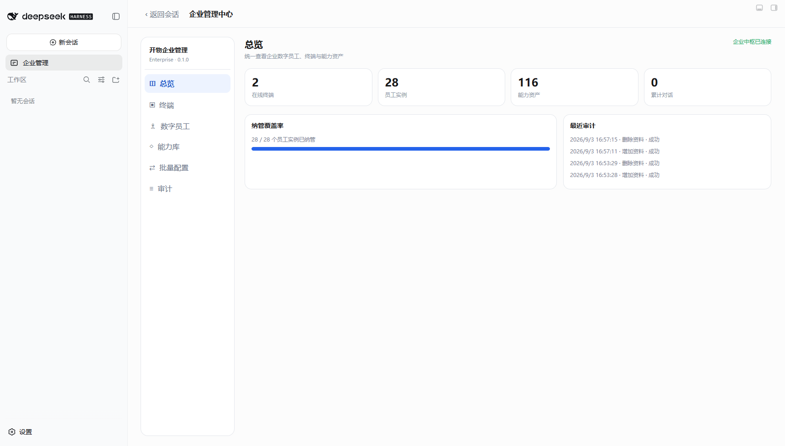
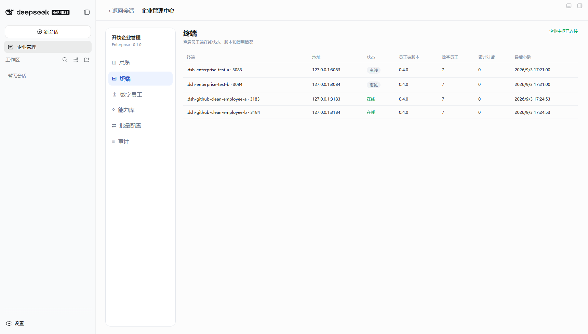
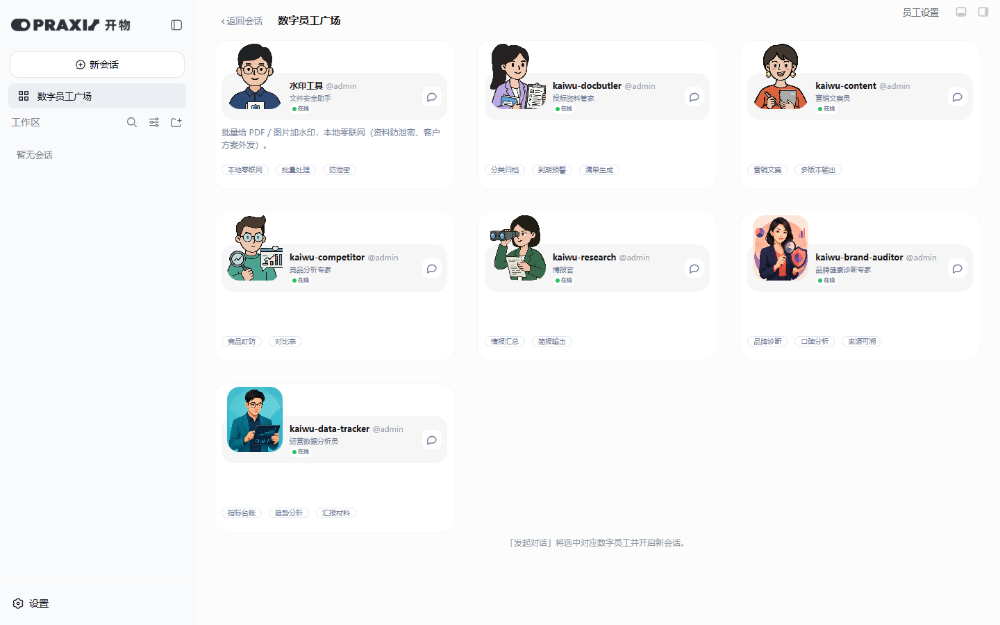
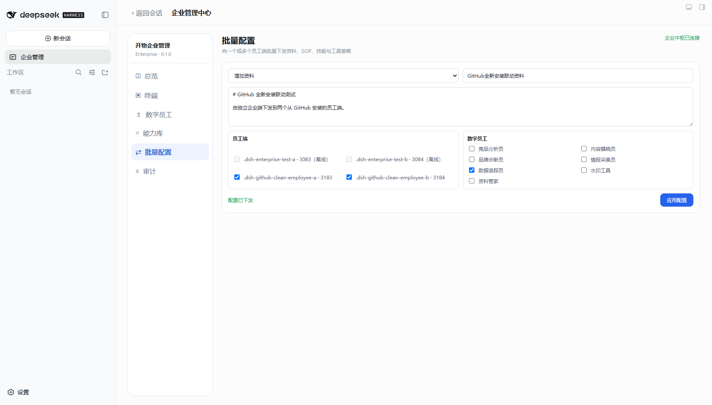
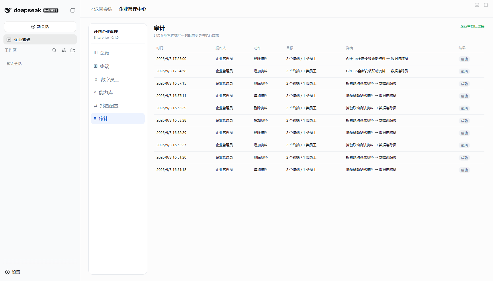

# P1 插件拆分 · GitHub 全新安装验收报告

## 结论

2026-09-03 已完成员工端与企业端独立发布，并在三个全新 DSH profile 中通过 GitHub 地址安装和联动验收。

- 企业端：`kaiwu-praxis-enterprise@0.1.0`，GitHub 标签 `v0.1.0`
- 员工端：`kaiwu-praxis@0.4.0`，GitHub 标签 `v0.4.0`
- 企业端实例：3182
- 员工端实例：3183、3184
- 三个实例均同时安装便携交付配置约定的三个配套插件
- 企业端与员工端插件没有混装，安装、版本和更新链路彼此独立
- 浏览器画面、跨端下发、真实文件落盘、删除同步、审计记录和控制台错误检查全部通过

## GitHub 仓库

- 员工端：https://github.com/motang1219/kaiwu-praxis
- 企业端：https://github.com/motang1219/kaiwu-praxis-enterprise

对应发布提交：

- 员工端 `a99c227`：`release: 拆分员工端 0.4.0`
- 企业端 `c1f869b`：`release: 企业管理端基础版 0.1.0`

## 全新安装方式

本轮没有使用本地 `link:`、已有 3082/3083/3084 profile 或本地 tgz。三个实例分别创建了全新的 `DSH_HOME`，由 DSH 的插件命令从 GitHub 标签安装。

企业端：

```text
git+https://github.com/motang1219/kaiwu-praxis-enterprise.git#v0.1.0
```

员工端：

```text
git+https://github.com/motang1219/kaiwu-praxis.git#v0.4.0
```

三个实例统一追加：

```text
@nanmicoder/dsh-agent-teams@0.1.14
@vectorize-io/hindsight-coding-agents@0.4.3
dsh-better-sidebar@0.17.1
```

安装命令使用 `--config.minimum-release-age=0`，原因是当前测试依赖树中的新版本包会触发 pnpm 的 minimum-release-age 策略。全新安装第一次还会由 pnpm 输出精确的构建白名单模板：企业端允许 `node-pty`，员工端允许 `node-pty` 与 `sharp`；将对应项设置为 `true` 后重跑安装成功。这些是 DSH/pnpm 的供应链保护流程，不是插件安装失败。

安装完成后核对 profile：依赖来源保持为 GitHub URL + 标签，四个插件均被 DSH 自动加入 `dsh.profile.bundles`。

## 浏览器与联动验收

### 1. 企业端独立启动

3182 只安装企业端插件，不包含员工端插件。页面仅出现“企业管理”入口；总览、终端、数字员工、能力库、批量配置、审计六个模块均可进入。页面右上角显示企业中枢已连接，控制台无错误。



总览显示 2 个在线终端。画面中的 28 个员工实例和 116 项能力资产包含企业中枢持久化保留的上一轮两个离线终端；本轮验收只选中并操作 3183、3184 两个新在线终端。

### 2. 两个员工端接入

终端页识别到：

- `.dsh-github-clean-employee-a · 3183`：在线，员工端 0.4.0，7 名员工
- `.dsh-github-clean-employee-b · 3184`：在线，员工端 0.4.0，7 名员工



两个员工端都只出现“数字员工广场”和“员工设置”，没有企业管理入口；广场均展示 7 张员工卡片。两端页面控制台错误均为 0。




### 3. 企业端批量配置

从 3182 选择两个新在线终端和“数据追踪员”，下发资料 `GitHub全新安装联动资料`。两个员工端均生成对应 Markdown 文件，读取到的内容逐字一致：

```markdown
# GitHub 全新安装联动测试

由独立企业端下发到两个从 GitHub 安装的员工端。
```



随后通过企业端下发“删除资料”，两个文件均消失，证明新增和删除不是前端假状态，而是真实跨插件落盘与回收。

### 4. 审计

审计页记录了本轮针对 2 个终端、1 类员工的“增加资料”和“删除资料”，两条结果均为成功。



## 验收数据

| 检查项 | 结果 |
| --- | --- |
| GitHub URL 安装企业端 | 通过 |
| GitHub URL 安装员工端 | 通过 |
| 三个配套插件版本与 bundles | 通过 |
| 管理端/员工端隔离 | 通过 |
| 企业端六模块 | 通过 |
| 两个员工端在线上报 | 通过 |
| 每端 7 名数字员工 | 通过 |
| 数字员工表 7 行 | 通过 |
| 能力库 14 行 | 通过 |
| 批量新增资料并真实落盘 | 通过 |
| 批量删除资料并真实删除 | 通过 |
| 审计新增/删除记录 | 通过 |
| 三个页面控制台错误 | 0 |

## 当前限制

- 企业中枢目前固定监听本机 `127.0.0.1:3099`，尚未实现跨机器终端、认证、RBAC 和 TLS。
- 企业中枢数据位于 `%LOCALAPPDATA%/kaiwu-praxis-enterprise/enterprise-hub.json`，因此重装 DSH profile 不会清除已登记的离线终端。这是持久化设计的当前行为。
- 本轮验证的是 GitHub 标签安装链路；便携交付包本身尚未重新打包。
