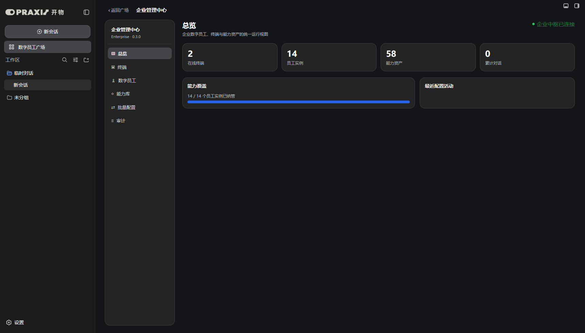
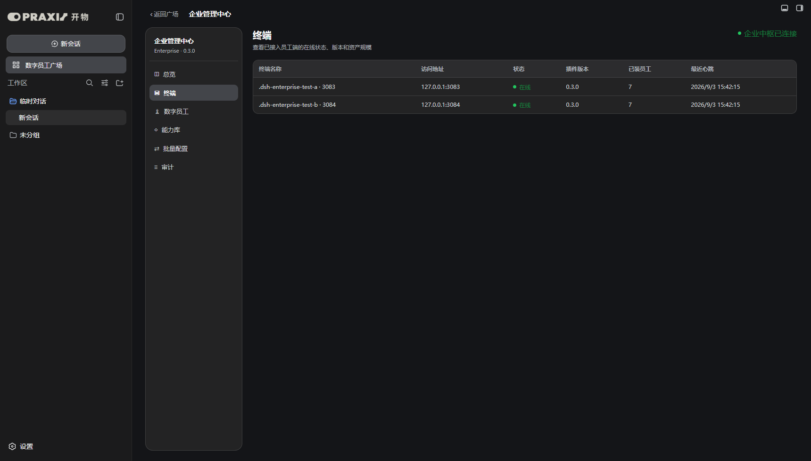
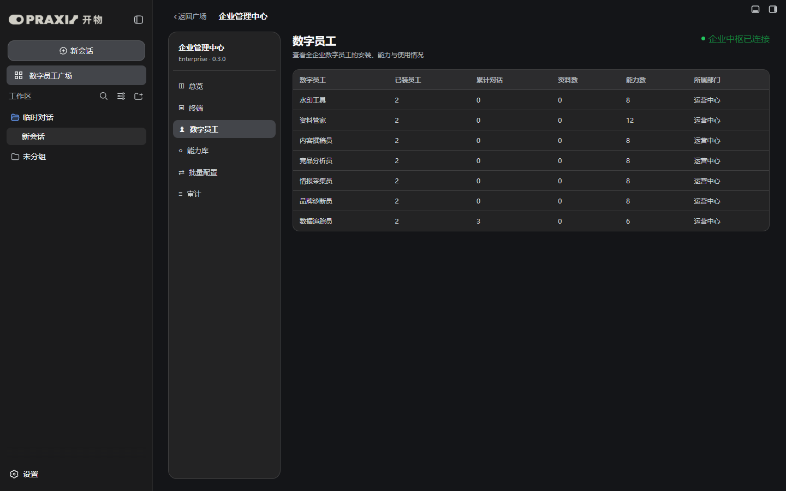
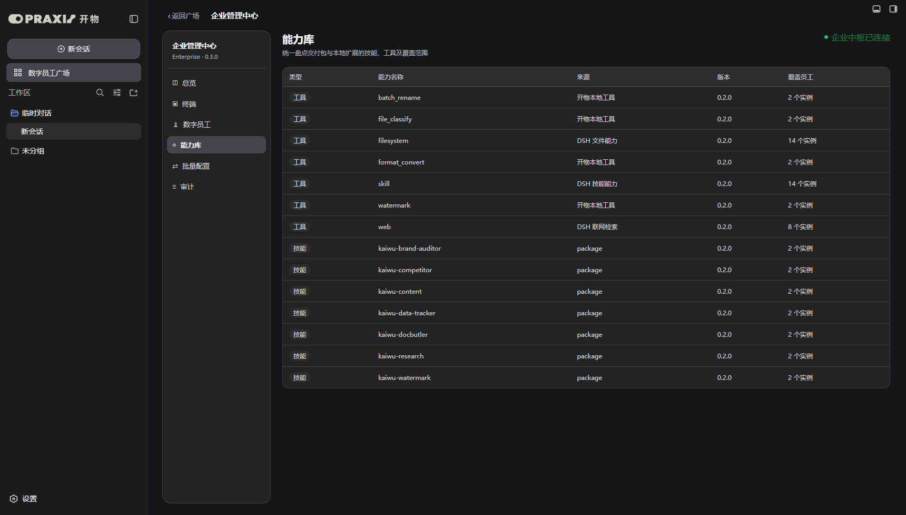
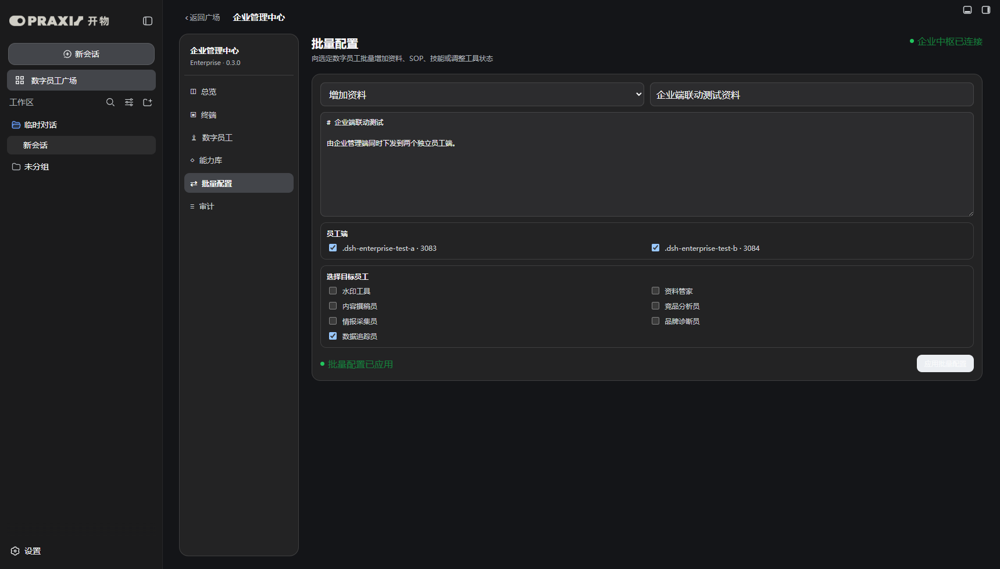
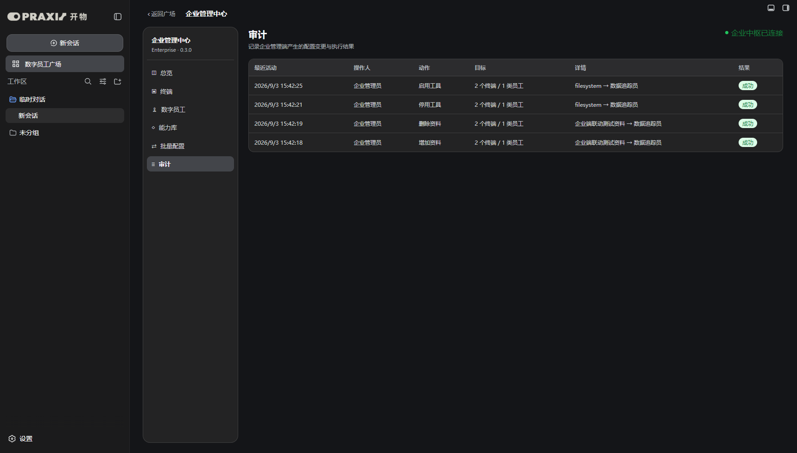
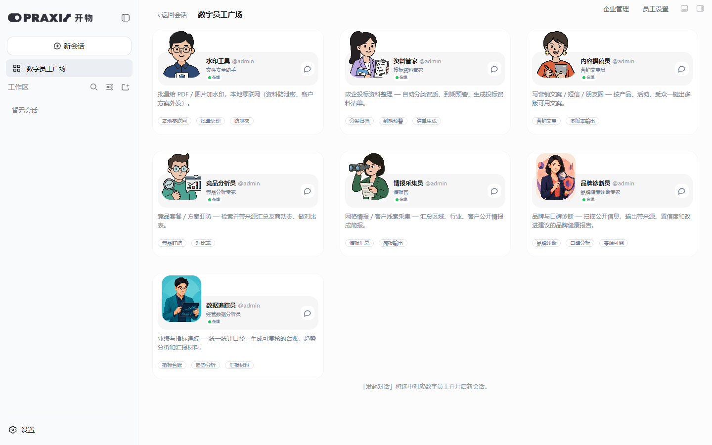

# 企业管理端基础版实机测试报告

测试日期：2026-09-03  
插件版本：`kaiwu-praxis 0.3.0`  
结论：**通过。企业端六个模块可用，三实例资产汇总、配置下发、使用统计与审计链路均已实机验证。**

## 1. 交付范围

本阶段新增独立的「企业管理」入口和六个模块：

1. **总览**：在线终端、员工实例、启用能力资产、累计对话和纳管覆盖。
2. **终端**：查看员工端名称、地址、在线状态、插件版本、员工数、对话数和最近心跳。
3. **数字员工**：按员工汇总跨终端安装数、累计对话、资料、启用能力和部门。
4. **能力库**：汇总技能与工具的名称、来源、版本和覆盖实例。
5. **批量配置**：选择员工端和数字员工，批量增加/删除资料、SOP、技能，以及启用/停用真实工具。
6. **审计**：记录操作时间、操作人、动作、目标、详情与最终执行结果。

企业管理端和原「员工设置」并存，均位于数字员工广场右上角；原员工设置的七个页面及其物化逻辑保持不变。

## 2. 三实例测试环境

| 角色 | 地址 | DSH_HOME | 开物插件 | 额外插件 |
| --- | --- | --- | --- | --- |
| 企业管理端 | `127.0.0.1:3082` | `C:\Users\86166\.dsh-fresh` | `kaiwu-praxis 0.3.0` | 原便携测试环境配置 |
| 员工端 A | `127.0.0.1:3083` | `C:\Users\86166\.dsh-enterprise-test-a` | 本地开发链接 | `dsh-agent-teams 0.1.14`、`hindsight-coding-agents 0.4.3`、`dsh-better-sidebar 0.17.1` |
| 员工端 B | `127.0.0.1:3084` | `C:\Users\86166\.dsh-enterprise-test-b` | 本地开发链接 | `dsh-agent-teams 0.1.14`、`hindsight-coding-agents 0.4.3`、`dsh-better-sidebar 0.17.1` |

3083 和 3084 是新建的空白 DSH_HOME。两边都不是只装开物本体：`package.json` 的 dependencies 和 bundles 均核验包含上述四个插件，浏览器内也确认 better-sidebar 的按钮组已加载。

## 3. 架构与数据边界

- 插件启动本机企业中枢 `127.0.0.1:3099`，只监听回环地址。
- 两个员工端每 3 秒上报终端心跳、版本和各自 settings 中的真实员工资产。
- 员工端浏览器从 DSH 会话快照上报总对话数及按员工分组的对话数。
- 企业端批量动作写入中枢指令队列；目标员工端拉取自己的指令，更新自己的 settings，再由原有 watch 机制把资料、SOP、技能和工具策略物化到各自 `.agent-presets`。
- 指令确认后，企业端审计状态由“执行中”更新为“成功”或具体失败原因。
- 中枢数据持久化到 `%LOCALAPPDATA%\kaiwu-praxis\enterprise-hub.json`。
- 浏览器跨端访问只允许来源为 `127.0.0.1` 或 `localhost`；测试确认合法来源返回 200，外部来源返回 403。

该基础版用于同一台电脑上的便携交付与联调，没有把中枢开放到局域网。后续改为真正企业中心服务时，可保留当前终端心跳、资产快照、指令和回执模型。

## 4. 页面验收

### 4.1 总览

两台员工端均在线，共汇总 14 个员工实例和 58 项启用能力；能力纳管覆盖为 14/14。

### 4.2 终端

终端列表识别到 3083 和 3084，均显示在线、插件版本 `0.3.0`、7 位员工及最近心跳。

### 4.3 数字员工与使用情况

数字员工页共 7 行，跨两端聚合安装数、对话数、资料数、能力数和部门。使用统计链路测试时向 3083 上报 3 条数据追踪员会话，企业端总览与数据追踪员行均正确显示 3；截图后已恢复测试值为 0。

### 4.4 能力库

能力库共聚合出 14 类技能/工具资产，能够区分技能与工具，并显示交付来源、能力版本和跨终端覆盖实例数。

### 4.5 批量配置

测试选择两台员工端，仅选择「数据追踪员」，批量增加 `企业端联动测试资料`。两个独立 DSH_HOME 下均生成同名 Markdown 文件，内容逐字一致。

随后执行删除资料，两个文件均被删除。又对两端数据追踪员执行：

1. 批量停用 `filesystem`；
2. 验证两端 `capabilities.json` 均包含 `read/write/edit/read_image`；
3. 验证两端 `agent.cordis.yml` 均移除 `tool-fs`；
4. 批量重新启用 `filesystem`；
5. 验证两端禁用列表清空，`tool-fs` 均恢复。

### 4.6 审计

增加资料、删除资料、停用工具、启用工具四次跨终端动作均记录，最终状态全部为成功。

## 5. 员工端画面与捆绑插件验证

两个新员工端各显示 7 位数字员工、「企业管理」「员工设置」两个入口以及 better-sidebar 按钮组。两端浏览器控制台均无错误。

## 6. 自动化与回归结果

| 测试 | 结果 |
| --- | --- |
| 企业端六项导航、总览指标、终端/员工/能力表 | 通过 |
| 两端批量增加与删除资料 | 通过 |
| 两端批量停用与恢复工具策略 | 通过 |
| 指令回执与审计最终状态 | 通过 |
| 会话使用情况聚合 | 通过 |
| 3083/3084 四插件 dependencies + bundles | 通过 |
| 3083/3084 广场普通点击、7 位员工、better-sidebar | 通过 |
| 原员工设置七页面 CRUD 回归 | 通过 |
| 企业中枢来源限制：本机 200 / 外部 403 | 通过 |
| 浏览器 console / page error | 0 |
| `node --check`：client/admin/hub | 通过 |
| 工具运行时 guard 单测 | 通过 |
| `npm pack --dry-run` | 通过，35 个文件，包大小约 761 KB |
| `git diff --check` | 通过，仅现有 Windows 换行提示 |

自动化脚本：

- `scripts/test-enterprise.mjs`
- `scripts/test-enterprise-endpoints.mjs`
- `scripts/test-enterprise-usage.mjs`
- `scripts/test-enterprise-smoke.mjs`
- `scripts/test-admin.mjs`

## 7. 测试后状态

- 3082、3083、3084 均保持运行，可继续人工查看。
- 两个员工端的联动测试资料均已删除。
- 两个员工端的 `filesystem` 工具均已恢复启用，禁用工具列表为空。
- 测试使用统计已恢复为 0；审计记录保留，作为本次真实联动测试证据。
- 没有改动或重新打包尚未更新的正式便携交付包。

## 8. 基础版限制

- 中枢当前只面向同机多实例，不含账号体系、组织级 RBAC、TLS 和跨机器通信。
- 终端离线阈值当前为 15 秒；基础版没有告警通知。
- 对话统计为数量级元数据，不上传对话正文，符合默认最小采集原则。
- 定时任务调度、插件升级/灰度/回滚仍属于后续阶段。
