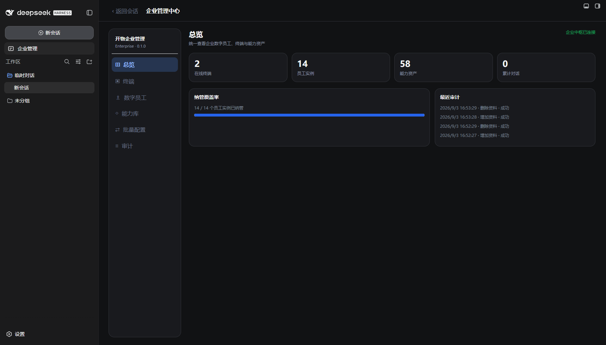
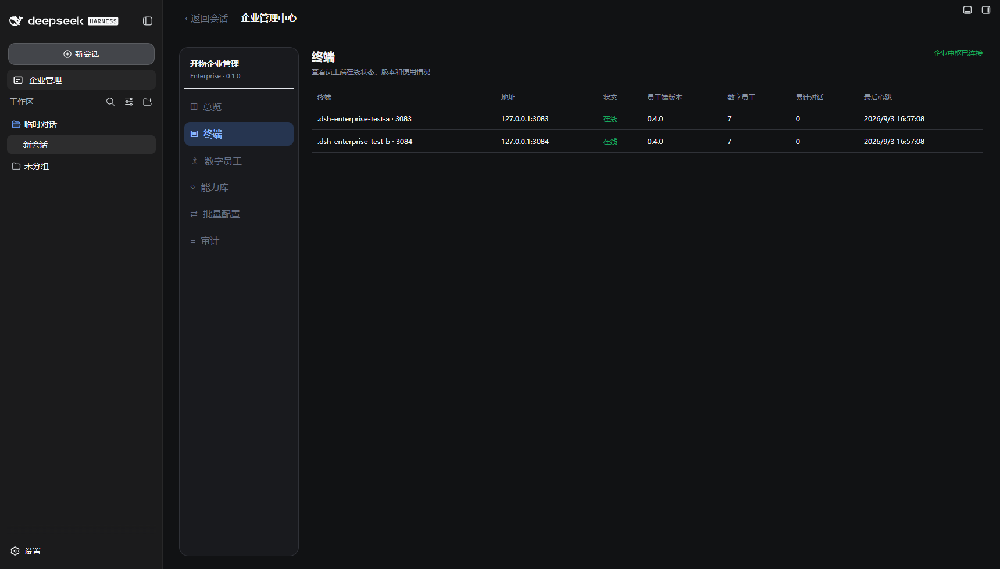
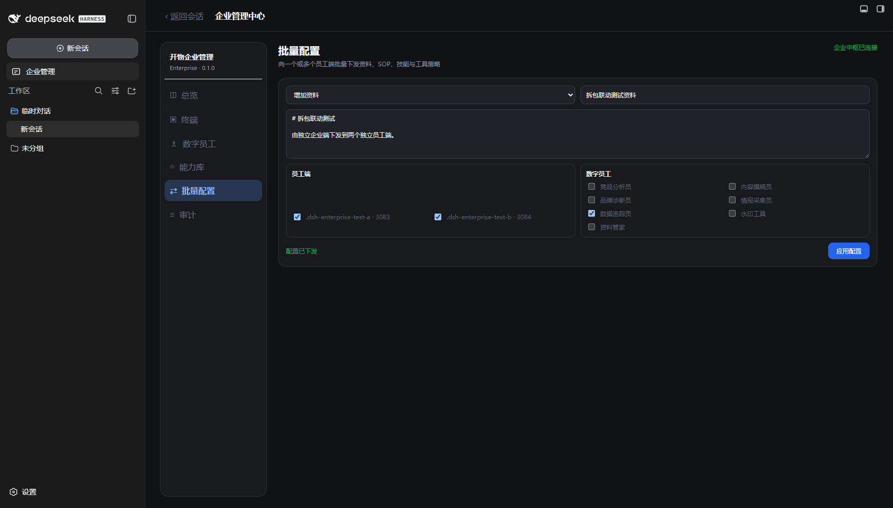
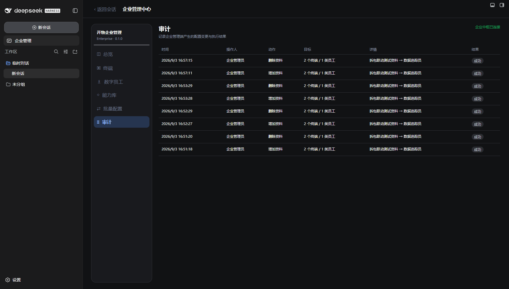
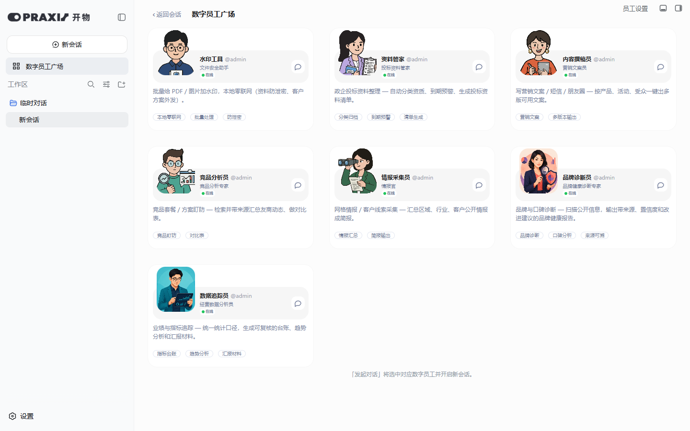
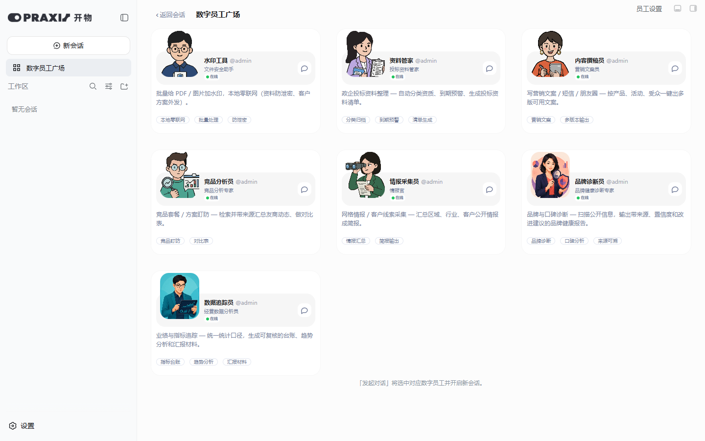

# 开物 Praxis 员工端 / 企业端插件拆分测试报告

- 测试日期：2026-09-03
- 员工端：`kaiwu-praxis@0.4.0`
- 企业端：`kaiwu-praxis-enterprise@0.1.0`
- 拆分前快照：`combined-v0.3.0-before-split`（`c24a57c`）

## 一、拆分结果

两个插件现在拥有独立的包名、版本号、入口、客户端代码和安装配置：

| 插件 | 职责 | 不包含 |
| --- | --- | --- |
| `kaiwu-praxis` | 7 名数字员工、员工广场、员工设置、确定性工具、能力物化、终端代理 | 企业管理入口、企业中枢服务 |
| `kaiwu-praxis-enterprise` | 企业管理入口、中枢服务、总览、终端、数字员工、能力库、批量配置、审计 | 数字员工预设、员工设置、员工工具 |

员工端未检测到企业中枢时保持静默，不影响数字员工本地使用；企业端独立负责监听 `127.0.0.1:3099`。企业端数据保存到 `%LOCALAPPDATA%/kaiwu-praxis-enterprise/enterprise-hub.json`。

## 二、实机安装矩阵

三个实例均保留便携交付环境约定的三个附加插件：Agent Teams、Hindsight Coding Agents、Better Sidebar。

| 端口 | DSH_HOME | 开物插件 | 结果 |
| --- | --- | --- | --- |
| 3082 | `.dsh-fresh` | 仅 `kaiwu-praxis-enterprise` | 企业管理入口存在；员工广场入口不存在 |
| 3083 | `.dsh-enterprise-test-a` | 仅 `kaiwu-praxis` | 7 名员工和员工设置存在；企业管理入口不存在 |
| 3084 | `.dsh-enterprise-test-b` | 仅 `kaiwu-praxis` | 7 名员工和员工设置存在；企业管理入口不存在 |

## 三、浏览器画面

### 3.1 独立企业端总览

企业端识别到 2 个在线员工端、14 个员工实例和 58 项能力资产。3082侧边栏只出现“企业管理”，没有员工广场入口。

### 3.2 独立企业端终端列表

两个终端均上报员工端版本 `0.4.0`，端口分别为3083和3084，每端7名数字员工。

### 3.3 跨插件批量配置

从独立企业端向两个独立员工端的数据追踪员下发“拆包联动测试资料”。两端均生成同名 Markdown 文件，内容完全一致；随后通过企业端删除，两个文件均已回收。

### 3.4 审计结果

新增与删除两条操作最终状态均为“成功”。

### 3.5 独立员工端

两个员工端均展示7名数字员工，右上角只有“员工设置”，没有企业管理按钮；浏览器控制台均无错误。

## 四、验证结果

| 项目 | 结果 |
| --- | --- |
| 两个包的 JavaScript 语法检查 | 通过 |
| 两个包 `npm pack --dry-run` | 通过；员工端35项，企业端6项 |
| 安装依赖隔离 | 通过；3082无员工包，3083/3084无企业包 |
| 企业中枢归属 | 通过；3099监听进程为3082企业端 |
| 六个企业管理模块 | 通过 |
| 两个员工端发现与版本上报 | 通过 |
| 跨插件资料新增、真实落盘 | 通过 |
| 跨插件资料删除、真实回收 | 通过 |
| 审计最终状态 | 通过 |
| 本机浏览器来源 | HTTP 200 |
| 外部网页来源 | HTTP 403 |
| 企业端浏览器控制台错误 | 0 |
| 两个员工端浏览器控制台错误 | 0 |

测试资料已经删除，未在员工端留下测试文件。测试产生的审计记录保留，作为配置链路证据。

## 五、当前边界

本次完成的是同机基础版拆包。企业中枢仍只监听本机回环地址，尚未实现跨机器服务、登录鉴权、RBAC、TLS、终端授权和升级服务；这些不影响本次“独立安装、独立升级”的包结构，但上线企业网络前必须补齐。
