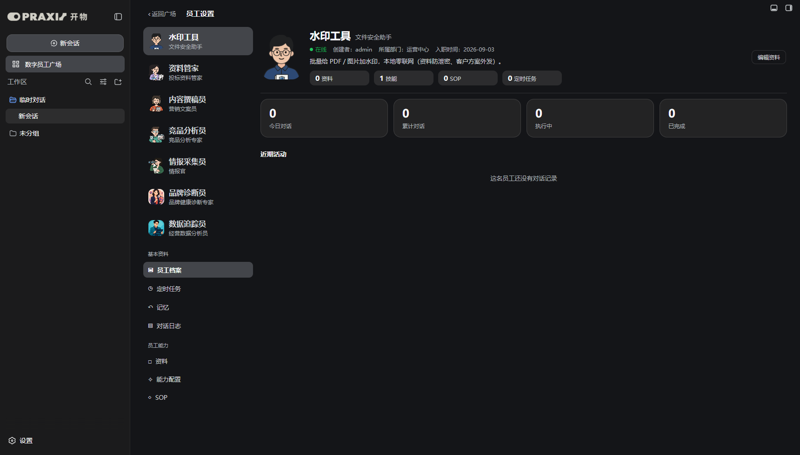
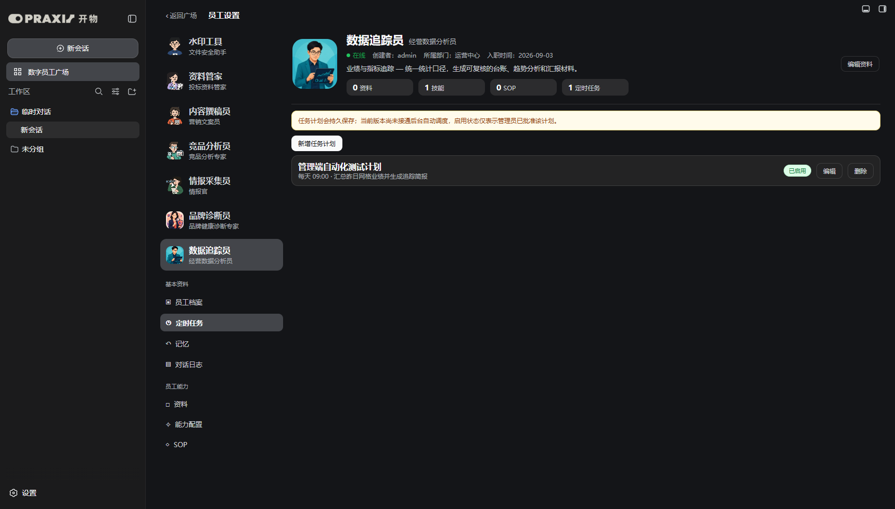
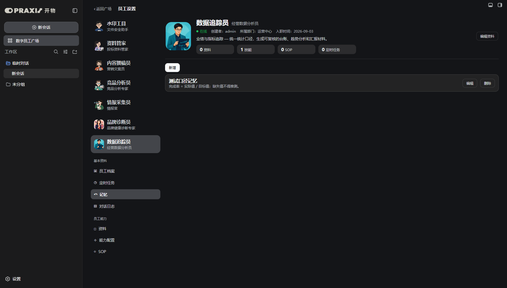
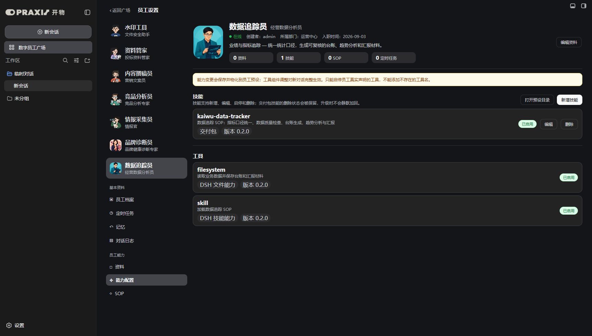
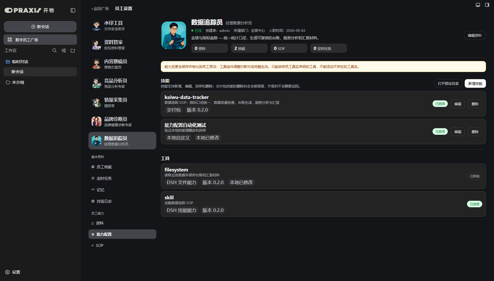
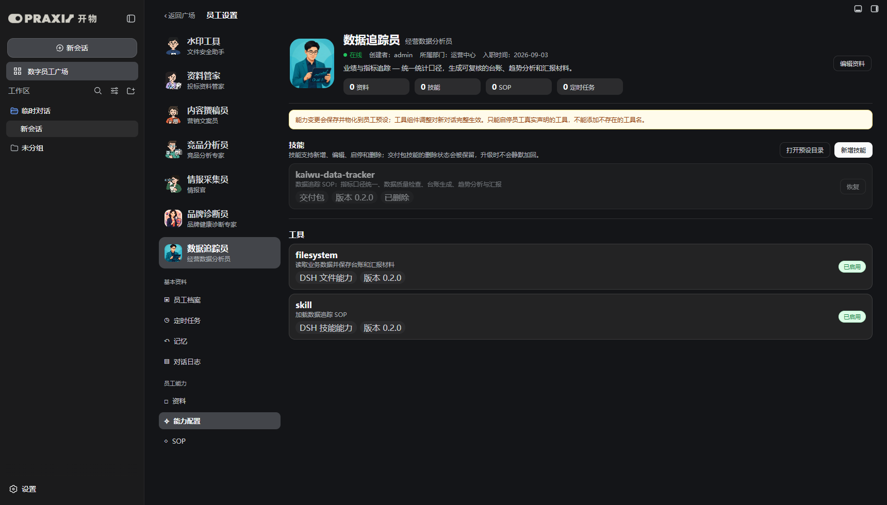
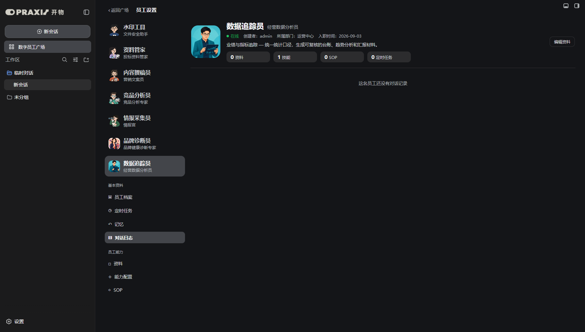
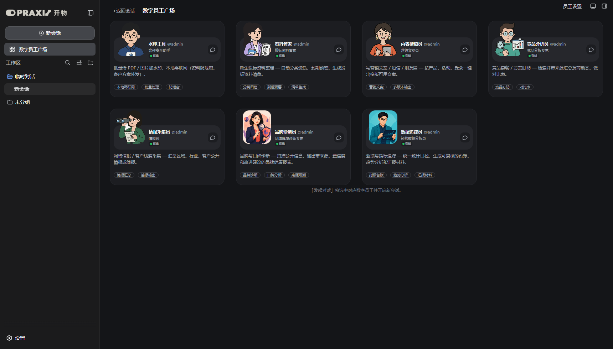

# 开物 Praxis 管理端实机测试报告

> 测试日期：2026-09-03  
> 测试环境：DSH `0.1.1-rc.2`，端口 `3082`，便携交付包插件组合  
> 插件组合：`kaiwu-praxis`、`@nanmicoder/dsh-agent-teams@0.1.14`、`@vectorize-io/hindsight-coding-agents@0.4.3`、`dsh-better-sidebar@0.17.1`

## 1. 结论

“员工设置”入口已经恢复，并完成员工档案、工作记录、定时任务配置、记忆、对话日志、资料、能力配置、SOP。7 名数字员工均可在设置页切换；可编辑数据写入 DSH settings，资料、SOP、技能和工具策略会物化到员工预设目录；工作记录与对话日志来自 DSH 真实会话快照。

自动化实机测试通过，浏览器控制台无报错。测试产生的任务、记忆、资料和 SOP 均在验证后删除，没有给交付环境留下测试数据。

## 2. 员工档案与工作记录

档案页展示员工头像、名称、岗位、在线状态、创建者、部门、入职日期、简介和能力资产数量。下方四项统计来自 DSH 会话快照，不使用模拟数据：今日对话、累计对话、执行中、已完成。

实测水印工具有 1 条当日已完成会话，页面显示值与 DSH 会话列表一致。

## 3. 定时任务配置

可以新增、编辑、删除任务计划，并保存任务名称、执行周期、执行指令和启停状态。测试中新增“管理端自动化测试计划”，切换启停状态，刷新页面后仍能读取到该任务，证明持久化有效。

当前版本只完成任务计划的管理与审批状态，尚未接通后台自动调度。页面用黄色提示明确说明这一点，避免用户误以为任务已经自动执行。

## 4. 记忆、资料与 SOP

记忆、资料和 SOP 均支持 Markdown 内容的新增、编辑和删除。测试分别写入并删除：

- 记忆：“测试口径记忆”
- 资料：“测试知识文档”
- SOP：“测试业务流程”

资料和 SOP 仍由宿主物化到对应员工的 `knowledge/`、`sop/` 目录，兼容原管理数据层。

## 5. 能力配置（技能与工具）

原先独立的“技能”和“工具”已合并为“能力配置”。技能支持新增、编辑、启停、删除和恢复；工具只允许在员工真实声明的能力清单中启停，不能填写不存在的工具名称。数据追踪员实测识别到 1 个技能、2 个工具能力组：`filesystem` 和 `skill`。

每项能力记录来源、包版本、本地修订和修改状态。本地技能会物化为 `skills/<id>/SKILL.md`；管理端生成的目录带归属标记，删除时只清理自身管理的目录，不删除用户手工维护的其他目录。

工具停用不是单纯修改界面开关：文件能力会从新对话的 `agent.cordis.yml` 中移除 `tool-fs` 组件，同时权限策略拦截当前会话里的真实运行时工具名 `read`、`write`、`edit`、`read_image`。

交付包技能删除后保留 tombstone。实测删除数据追踪技能、重启 DSH 后，设置页仍显示“已删除”，技能目录没有被升级播种逻辑恢复；点击“恢复”后文件重新物化。

## 6. 对话日志

对话日志按员工过滤 DSH 会话，展示标题、最近活动时间、运行状态和会话 ID。没有对话时显示明确空状态，不制造示例日志。

## 7. 自动化测试结果

| 测试项 | 结果 |
| --- | --- |
| 管理端入口恢复 | 通过 |
| 7 名员工列表与切换 | 通过 |
| 7 个设置模块导航，技能与工具合并 | 通过 |
| 员工档案与真实会话统计 | 通过 |
| 任务新增、启停、刷新持久化、删除 | 通过 |
| 记忆新增、保存、删除 | 通过 |
| 资料新增、保存、物化、删除 | 通过 |
| SOP 新增、保存、物化、删除 | 通过 |
| 技能新增、编辑、启停、刷新持久化、删除 | 通过 |
| 官方技能删除标记跨 DSH 重启保留、恢复 | 通过 |
| 工具能力组启停、真实运行名拦截、预设组件物化 | 通过 |
| 对话日志员工过滤与空状态 | 通过 |
| `lib/client.js` / `lib/admin.mjs` 语法检查 | 通过 |
| `git diff --check` | 通过 |
| `npm pack --dry-run`（33 个交付文件） | 通过 |
| 浏览器 console / page error | 0 个 |

## 8. 实机修正记录

便携环境中的 `dsh-better-sidebar` 浮动按钮一度覆盖广场右上角“管理端”入口。已在广场打开期间禁用该插件浮层及其子元素的指针事件，并提高开物覆盖层层级。修正后使用普通鼠标点击通过，不依赖强制点击。

2026-09-03 后续回归中，入口文案统一改为“员工设置”，并根据 `[data-dsh-toggle-cluster]` 的实时边界锚定在两个侧边栏按钮左侧；没有安装侧边栏插件时仍使用原顶部栏位置。1720×980 实测入口与按钮组顶部均为 `3px`、高度均为 `28px`、水平间距为 `8px`，普通点击进入后的标题为“员工设置”，浏览器 console / page error 为 0。

旧 settings 首次迁移时，新增的入职日期可能被 schema 默认空字符串覆盖。已调整合并策略：空日期自动写入首次升级日期，已有自定义日期保持不变。重启验证后显示 `2026-09-03`。

能力 schema 升级时发现旧 P0 设置可能生成正文与官方技能相同的“未命名技能”占位。迁移逻辑现以旧占位 ID 和官方正文完全匹配为条件精确清理；最终 3082 settings 中此类占位为 0。

## 9. 暂未纳入本轮的能力

- 后台定时调度执行器；目前只保存计划配置和管理员启停状态。
- 好评率、差评率与 Token 用量；当前 DSH 管理端没有稳定可用的数据接口，因此本轮没有用假数据占位。
- 多租户、坐席授权、权限回收和企业级审计；属于总体路线图里的完整管理后台后续项。
