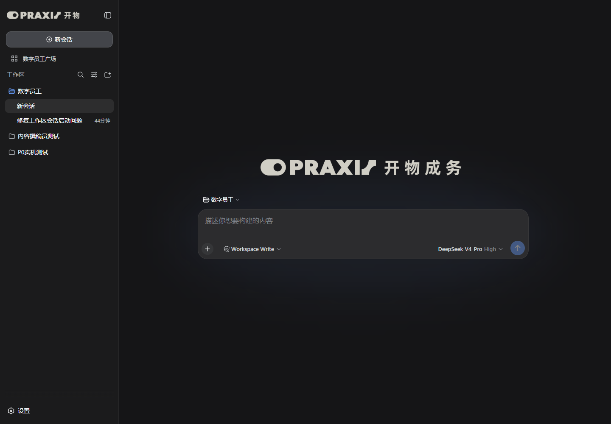
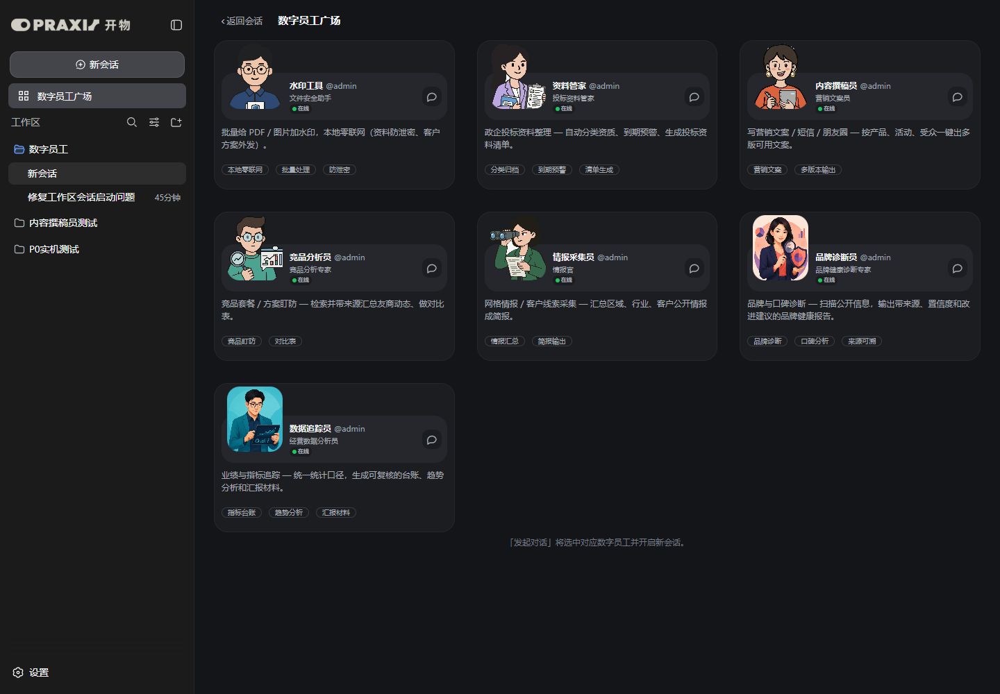
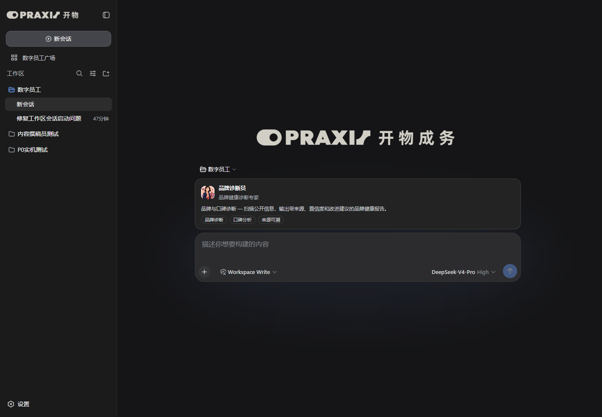
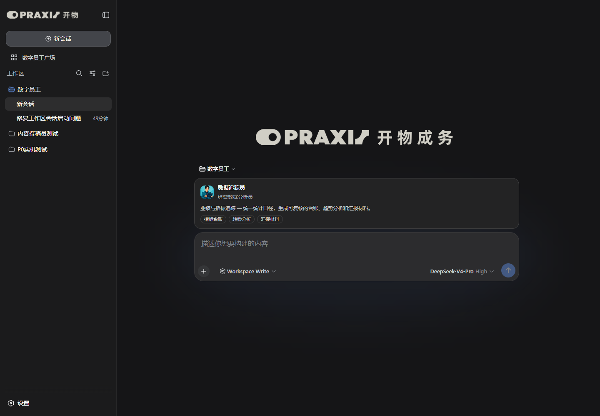
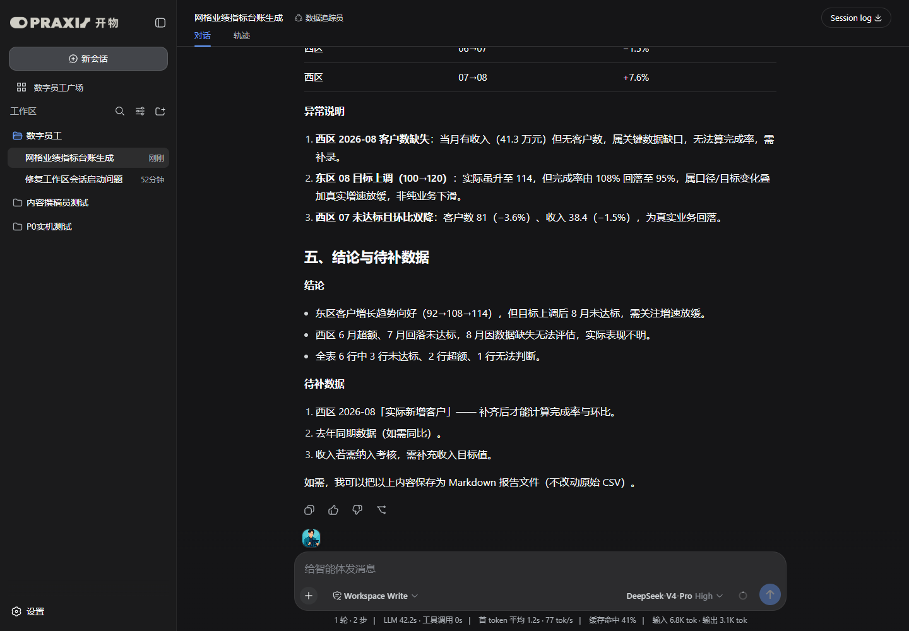
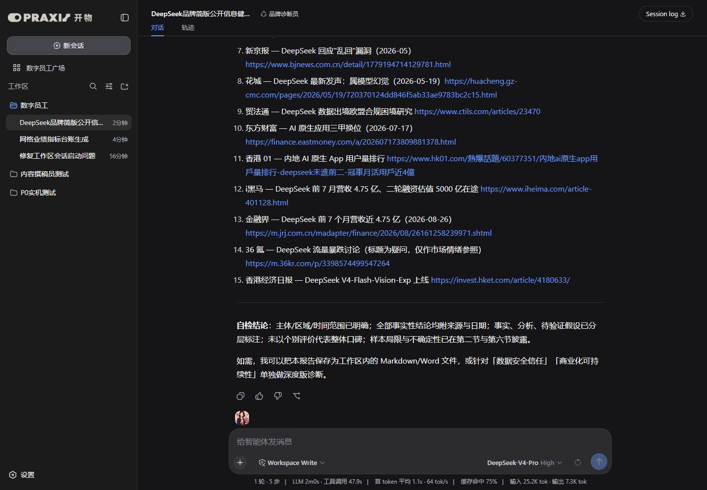
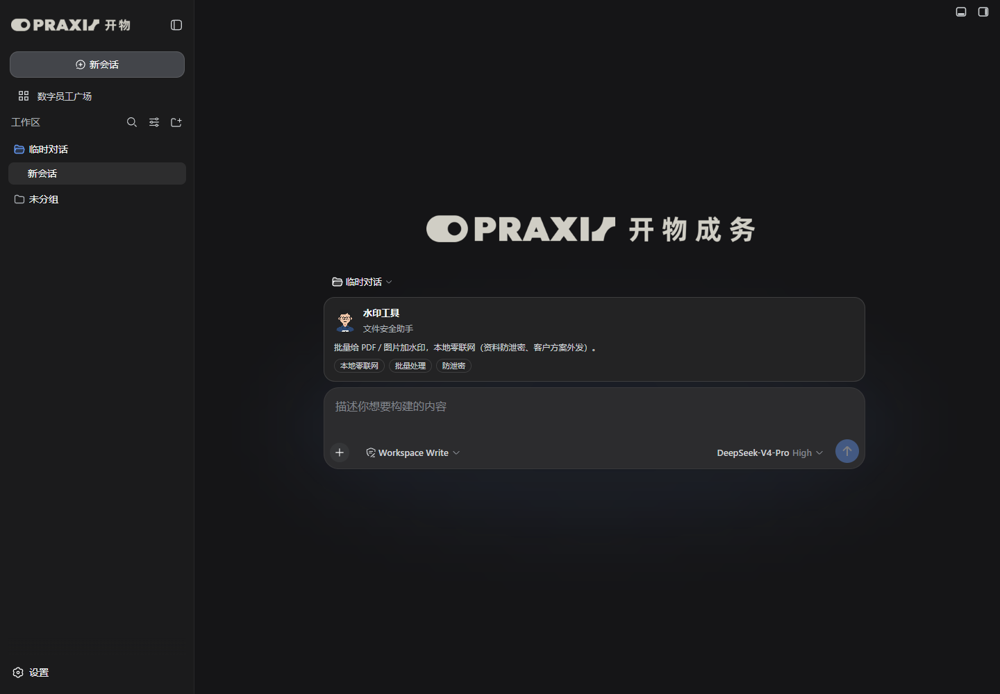
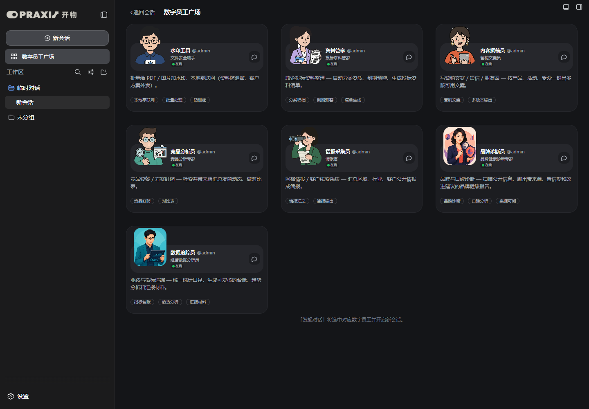

# 品牌诊断员、数据追踪员实机测试报告

> 测试日期：2026-09-03  
> 测试环境：DeepSeek Harness 0.1.1-rc.2，`DSH_HOME=C:\Users\86166\.dsh-fresh`，`http://127.0.0.1:3082`  
> 代码基线：在 `139c518` 上增加两名数字员工，测试时工作区含本次未提交改动

## 一、测试结论

品牌诊断员与数据追踪员已完成预设、Persona、专属 SKILL、宿主播种、管理数据、广场卡片、头像和会话能力卡片接入。3082 实机共显示 7 名数字员工，两名新员工均能从广场进入会话、加载自己的技能并完成真实任务。

结论：**本次功能通过测试。** 未发现产品代码阻塞问题，未重新打包 Windows 便携版。

## 二、实现范围

### 品牌诊断员

- preset id：`kaiwu-brand-auditor`
- 定位：扫描公开信息，输出带来源、置信度和行动建议的品牌健康诊断
- 强制约束：事实与分析分离、重要结论交叉验证、标注置信度、披露样本局限、不得以个别评论代表整体口碑
- 工具：Web 检索、文件系统、技能加载

### 数据追踪员

- preset id：`kaiwu-data-tracker`
- 定位：统一指标口径，生成可复核的台账、趋势分析和汇报材料
- 强制约束：保留原始数据、公开计算公式、不猜测缺失值、标记口径冲突、结论可回溯
- 工具：文件系统、技能加载

## 三、静态与启动检查

| 检查项 | 结果 |
| --- | --- |
| `lib/client.js`、`lib/index.js`、`lib/admin.mjs` 语法检查 | 通过 |
| 7 份 `agent.cordis.yml` 结构解析 | 通过；`!!js` 是 DSH 自定义标签，普通 YAML 解析器仅给出预期警告 |
| `git diff --check` | 通过 |
| npm 打包清单 | 33 个文件；包含两套新预设及两张头像 |
| 3082 宿主启动 | HTTP 200，stderr 无插件报错 |
| 用户预设播种 | `.agent-presets` 下实际出现 7 个 `kaiwu-*` 目录 |

## 四、浏览器视觉测试

### 4.1 初始页面与客户版皮肤

开物品牌替换、侧边栏入口和客户版隐藏项保持正常。

### 4.2 数字员工广场

浏览器 DOM 实测 `.kwp-card` 数量为 7，名称依次为水印工具、资料管家、内容撰稿员、竞品分析员、情报采集员、品牌诊断员、数据追踪员。两张新头像可区分职责，卡片未出现乱码、头像彩边或内容溢出。

### 4.3 品牌诊断员能力卡

点卡后实际选中 `kaiwu-brand-auditor`，空白会话显示品牌诊断员名称、角色、简介、头像和“品牌诊断 / 口碑分析 / 来源可溯”标签。

### 4.4 数据追踪员能力卡

点卡后实际选中 `kaiwu-data-tracker`，空白会话显示数据追踪员名称、角色、简介、头像和“指标台账 / 趋势分析 / 汇报材料”标签。

## 五、真实能力测试

### 5.1 数据追踪员

测试输入为 `fixture-网格业绩.csv`，包含两个网格、三个月的目标/实际/收入数据，并故意将“西区 2026-08 实际新增客户”留空。

实际结果：

- 主动加载 `kaiwu-data-tracker` 技能并读取 CSV。
- 正确识别 6 行数据和 1 处缺失值，没有猜测补值。
- 明确给出完成率、环比公式和舍入规则。
- 生成指标台账、趋势、异常说明、结论和待补数据。
- 正确指出没有去年同期数据，不能计算同比。
- 原始 CSV 未被修改。

执行用时约 42 秒，结果符合 SOP。

### 5.2 品牌诊断员

测试任务：对 DeepSeek 品牌做中国范围、截至 2026-09-03 的简版公开信息健康诊断，要求至少 3 个来源，并区分事实、分析和待验证假设。

实际结果：

- 主动加载 `kaiwu-brand-auditor` 技能。
- 执行 5 个检索步骤，最终列出 15 个来源 URL。
- 按品牌可见度、口碑、信任三个维度输出诊断。
- 对结论标注高、中、中高置信度。
- 明确分开“事实”“分析”“待验证假设”。
- 披露只基于公开搜索、未做社媒抽样等样本局限。
- 输出风险、机会和立即/近期/持续三档行动建议。

执行用时约 2 分 29 秒，行为符合“检索 + 引用来源”的硬约束。

## 六、测试中发现的问题与处理

自动化脚本第一次切换数据追踪员后，立即命中了页面中尚未更新的上一张品牌诊断员能力卡，导致截图内容错误。复查 DOM 后确认是测试等待条件过宽，不是产品切换失败。测试脚本改为等待 `.kwp-chatName` 明确变为“数据追踪员”后重新截图，复测通过。

## 七、未纳入本次范围

- 没有更新 `F:\dsh-build` 便携包及 ZIP/EXE；本轮仅完成源码和 3082 开发实例验证。
- 没有修改当前客户版对管理端和统计栏的隐藏策略。
- 品牌诊断的事实准确性仍取决于检索源质量；本次验收重点是工作流、引用、证据分级和不确定性披露是否生效。

## 八、测试环境补齐记录

完成上述两名员工的首次测试后，3082 测试 profile 已按便携交付包补装并启用以下插件：

- `@nanmicoder/dsh-agent-teams@0.1.14`
- `@vectorize-io/hindsight-coding-agents@0.4.3`
- `dsh-better-sidebar@0.17.1`

此后默认以“DSH 基础组件 + kaiwu-praxis 当前开发版 + 上述三个固定版本插件”作为 3082 测试基线。

验证结果：3082 启动后 HTTP 200，浏览器没有 console error；开物、agent-teams、better-sidebar 的客户端资源实际加载，agent-teams 状态接口可访问。hindsight 的 npm 包仅声明宿主 bundle，不提供浏览器 client，宿主启动无加载错误。

三插件环境下数字员工广场仍显示 7 张卡片，名称与头像正常。
