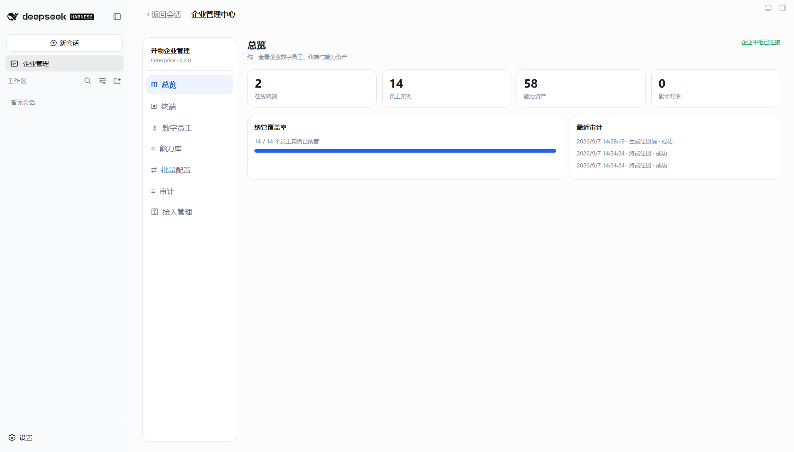
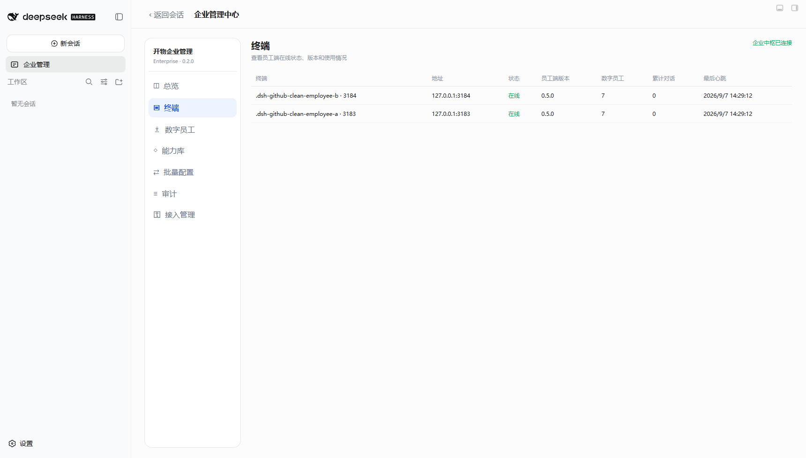
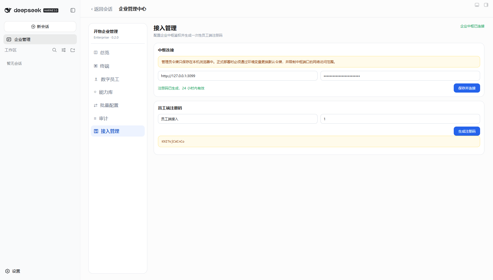
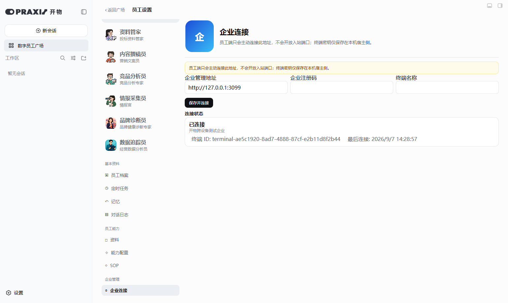
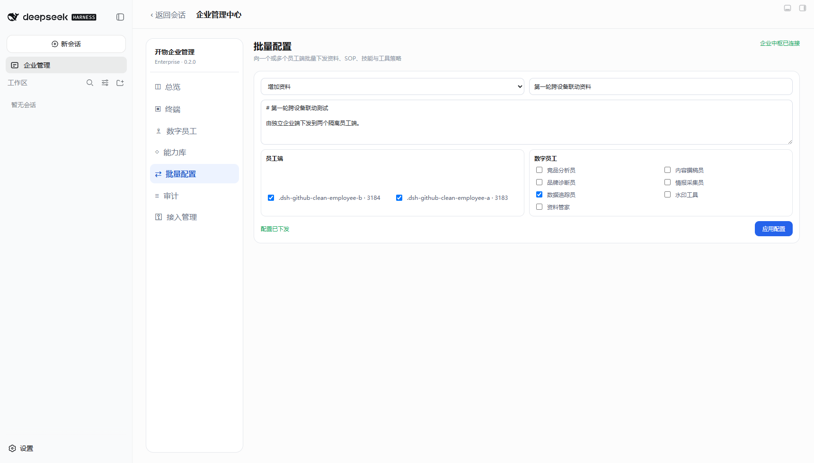
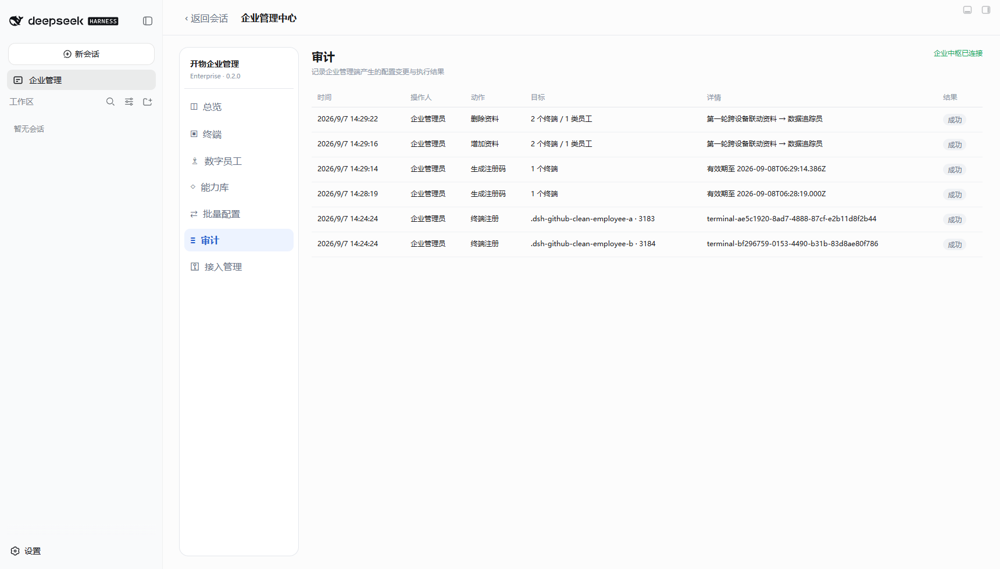
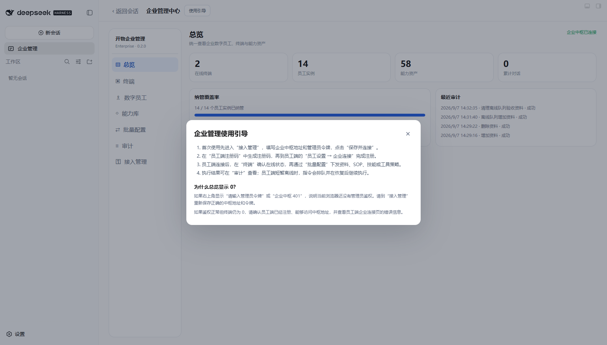
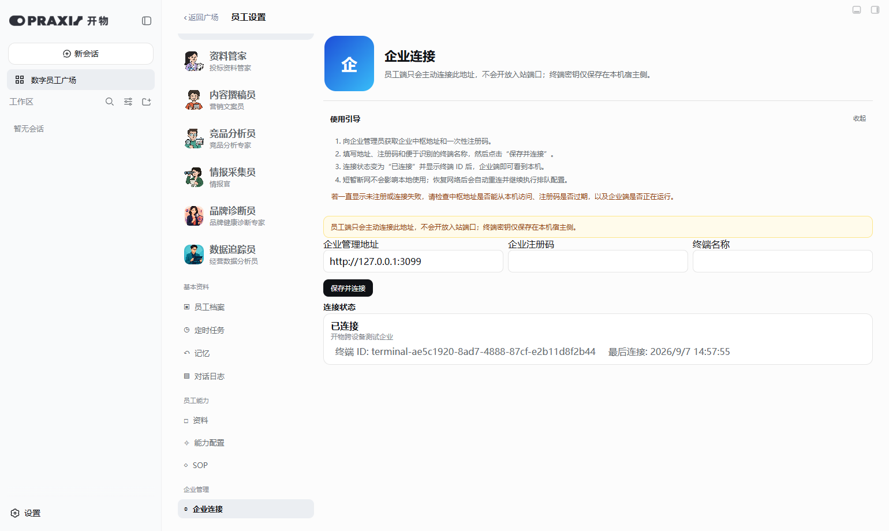

# 开物 Praxis 跨设备基础版第一轮开发与验收报告

日期：2026-09-07  
员工端版本：`kaiwu-praxis 0.5.0`  
企业端版本：`kaiwu-praxis-enterprise 0.2.0`

## 1. 本轮结论

第一轮开发与单机隔离验收通过。企业管理端和两个员工端以三个独立 `DSH_HOME`、三个独立 Web 端口运行，员工端均安装便携交付约定的三个配套插件。已验证终端注册、鉴权、心跳、资产汇总、批量下发、文件落盘、删除、审计、离线队列、幂等状态记录和企业中枢重启持久化。

本轮属于“单机模拟三设备”验收，不等同于真实跨物理设备测试。真实公司内网或 VPN 环境的双机验收留到下一轮。

## 2. 实现内容

### 企业管理端

- 中枢监听地址和端口可配置，默认仅监听 `127.0.0.1:3099`。
- 管理员 API 使用 Bearer 令牌鉴权；非本机监听却仍使用默认令牌时拒绝启动。
- 新增接入管理页面，可配置中枢地址和管理员令牌，并生成有有效期、使用次数限制的一次性注册码。
- 终端、注册码、指令队列和审计数据改为 SQLite 持久化，启用 WAL。
- 指令状态覆盖 `queued / delivered / running / succeeded / failed`，记录尝试次数与有效期。
- 保留总览、终端、数字员工、能力库、批量配置和审计模块。

### 员工端

- 员工设置新增“企业连接”，可填写中枢地址、一次性注册码和终端名称。
- 员工端只主动访问中枢，不开放入站端口。
- 每个 `DSH_HOME` 自动生成永久终端 UUID；终端密钥只写入宿主侧 `.kaiwu-enterprise/terminal.json`，不进入浏览器 settings。
- 注册成功后清除 settings 中的注册码。
- 指令执行前报告 running，完成后确认成功或失败；执行结果先本地持久化，回执丢失时不会重复执行配置。
- 中枢不可达不影响员工端独立使用，恢复后继续拉取排队指令。

## 3. 测试环境

| 角色 | Web 端口 | 隔离目录 | 开物插件 | 配套插件 |
| --- | ---: | --- | --- | --- |
| 企业管理端 | 3182 | `.dsh-github-clean-manager` | 企业端本地链接 0.2.0 | agent-teams 0.1.14、hindsight 0.4.3、better-sidebar 0.17.1 |
| 员工端 A | 3183 | `.dsh-github-clean-employee-a` | 员工端本地链接 0.5.0 | 同上 |
| 员工端 B | 3184 | `.dsh-github-clean-employee-b` | 员工端本地链接 0.5.0 | 同上 |

本地链接用于测试尚未提交的工作区代码；三个配套插件使用各自已锁定的 npm 版本。两个员工端的模型 API 由用户在 DSH 界面配置，本次跨设备配置链路本身不读取或记录 API Key。

## 4. 验收结果

| 项目 | 结果 | 证据 |
| --- | --- | --- |
| 管理员未授权/错误令牌 | 通过 | `/api/state` 返回 401 |
| 非法浏览器 Origin | 通过 | 返回 403 |
| 非本机监听安全门槛 | 通过 | 未设置自定义管理员令牌时拒绝以 `0.0.0.0` 启动 |
| 一次性注册码生成与错误码拒绝 | 通过 | 正确码注册成功，错误码返回 403 |
| 两个隔离终端身份 | 通过 | 两个不同 UUID，均显示 0.5.0 和独立端口 |
| 终端心跳与资产汇总 | 通过 | 2 个在线终端、14 个员工实例、58 项能力资产 |
| 企业端七个模块 | 通过 | 总览、终端、数字员工、能力库、批量配置、审计、接入管理均可打开 |
| 双端批量增加资料 | 通过 | 资料同时落盘到两个员工端的数据追踪员目录，内容为 UTF-8 中文 |
| 双端批量删除资料 | 通过 | 两端文件均删除，审计结果更新为成功 |
| 离线队列 | 通过 | 3184 停止后命令保持 queued；重启后自动执行并变为 succeeded |
| 企业中枢重启持久化 | 通过 | 重启前后仍为 2 个终端、8 条审计、6 条成功指令；两端自动恢复在线 |
| 浏览器控制台 | 通过 | 企业端及两个员工端未发现相关脚本错误 |
| 两端使用引导 | 通过 | 企业端弹窗与员工端折叠引导均可点击；未鉴权时自动进入接入管理 |
| 语法、打包与回归 | 通过 | `node --check`、两端 `npm pack --dry-run`、中枢 18 项接口检查、分类/工具策略/水印回归通过 |

## 5. 浏览器截图

### 企业端总览：两个员工端在线

### 终端身份、版本和地址

### 接入管理与注册码

截图中的注册码属于本地测试中枢的短期测试码，不是管理员令牌或模型 API Key。

### 员工端企业连接状态

### 批量配置下发到两个员工端

### 审计记录执行结果

### 企业端使用引导

### 员工端企业连接使用引导

## 6. 当前边界与下一轮建议

- 当前中枢原生提供 HTTP。公司内网可先使用，跨地点建议接入公司 VPN/零信任网络；不要直接暴露公网。公网部署应增加 HTTPS 反向代理、网络访问控制和备份。
- 当前是单管理员令牌，尚未实现账号体系、RBAC、终端吊销、令牌轮换和注册码手动失效。
- 企业管理页面若从另一台电脑浏览，需要把其精确 Origin 加入 `KAIWU_ENTERPRISE_ALLOWED_ORIGINS`。
- 下一轮应在真实两台设备上验证 IP 可达、防火墙、断网恢复和较长时间心跳，并补齐终端禁用/删除、命令详情和失败重试操作界面。
