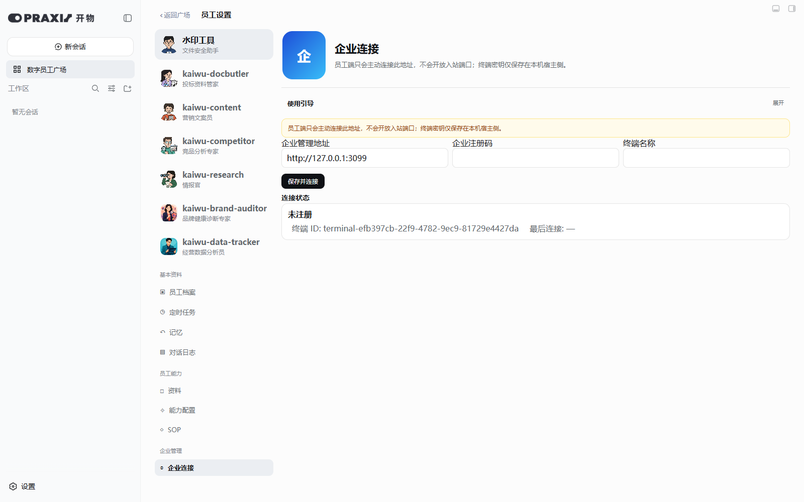

# 便携包 v0.5.0 打包验收记录

打包日期：2026-09-07

用途：第二轮跨设备实机测试的家里电脑员工端

## 交付文件

| 文件 | 大小（字节） | SHA-256 |
|---|---:|---|
| `kaiwu-praxis-portable-v0.5.0.zip` | 212551791 | `3EFC299E62FC033ADA214336683423DFFF1619E3BFEA3D5B2851CC63983DE16A` |
| `kaiwu-praxis-setup-v0.5.0.exe` | 89891520 | `D2B740C4D1895C32C286049557D73520C876AA8F9074815D6E53DD9F006BB664` |

建议把 ZIP 和《家里电脑Codex前置准备任务书》发到家里电脑；EXE 作为体积更小的备选交付形式。内部构建文件 `payload-v0.5.0.7z` 不需要发送给测试端。

## 固定插件版本

- `kaiwu-praxis`：GitHub 标签 `v0.5.0`，锁定提交 `0dd1b05d678e073a4ebae50339b5db4a3bd70908`
- `@nanmicoder/dsh-agent-teams`：`0.1.14`
- `@vectorize-io/hindsight-coding-agents`：`0.4.3`
- `dsh-better-sidebar`：`0.17.1`

企业管理插件 `kaiwu-praxis-enterprise` 未装入本员工端便携包。首次启动前，包内 `home` 顶层只有 `profiles`，不包含模型 API Key、企业注册码、终端身份或第一轮测试数据。

## 验收结果

1. ZIP、EXE 和内部 7z 均通过 `7z t` 完整性检查。
2. ZIP 已解压到独立目录，并用包内 Node/DSH 在独立端口 `3380` 实际启动。
3. 浏览器实测数字员工卡片数为 7。
4. “员工设置 → 企业连接”可打开且内置使用引导存在。
5. 员工端页面不存在企业管理端入口。
6. 浏览器控制台未捕获脚本错误。

