# 开物 Praxis 第二轮跨设备实机测试验收报告

## 1. 验收结论

**验收通过。**

本轮在两台物理设备、两个独立网络环境下完成了企业中枢与员工端的跨设备实机验证。企业中枢能够同时纳管员工端A和员工端B，完成在线批量配置、离线指令排队、恢复后自动执行、执行结果回执、企业中枢重启后数据持久化，以及测试资料清理。

截至 2026-09-08 17:01（Asia/Shanghai）：

- 企业中枢：版本 `0.2.1`，3182 管理页面和 3099 API 正常运行。
- 员工端A：版本 `0.5.0`，在线，7 名数字员工。
- 员工端B：版本 `0.5.0`，在线，7 名数字员工。
- 企业数据库：2 个终端、14 个员工实例、58 项能力资产。
- 配置指令：共 7 条，全部为 `succeeded`，每条只执行 1 次。
- 两份验收资料已从员工端A和员工端B全部清理，审计记录保留。
- 未暴露或记录模型 API Key、管理员令牌、企业注册码和终端密钥。

## 2. 测试范围与环境

### 2.1 拓扑

```text
企业中枢
├─ 管理页面：127.0.0.1:3182
├─ 中枢 API：100.71.50.62:3099（Tailscale）
├─ SQLite：C:\Users\86166\.kaiwu-enterprise-round2\enterprise.db
└─ 员工端A：100.71.50.62:3183

远端设备
└─ 员工端B：100.121.96.23:3080
   └─ 主动连接企业中枢 100.71.50.62:3099
```

员工端无需开放入站业务端口；企业中枢只通过 Tailscale 虚拟内网向员工端提供 3099 服务。

### 2.2 软件版本

| 组件 | 版本/配置 |
|---|---|
| 企业端插件 | `kaiwu-praxis-enterprise 0.2.1` |
| 员工端插件 | `kaiwu-praxis 0.5.0` |
| 配套插件 | `@nanmicoder/dsh-agent-teams 0.1.14` |
| 配套插件 | `@vectorize-io/hindsight-coding-agents 0.4.3` |
| 配套插件 | `dsh-better-sidebar 0.17.1` |
| 虚拟内网 | Tailscale；无法直连时经 DERP 中继 |
| 员工端B运行方式 | v0.5.0 便携交付包，已启用无人值守模式 |

## 3. 交付包与启动验收

员工端B使用 `kaiwu-praxis-portable-v0.5.0.zip`。SHA-256 为：

```text
3EFC299E62FC033ADA214336683423DFFF1619E3BFEA3D5B2851CC63983DE16A
```

哈希与任务书一致，解压目录包含 `app`、`home`、`runtime` 和 `start.bat`，员工端及三个配套插件版本符合要求。

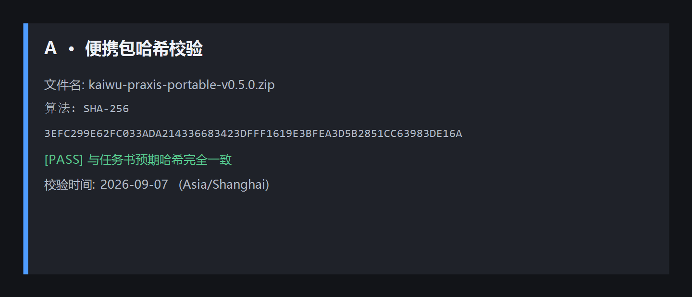


员工端B启动后，3080 返回 HTTP 200，企业连接配置可自动恢复。

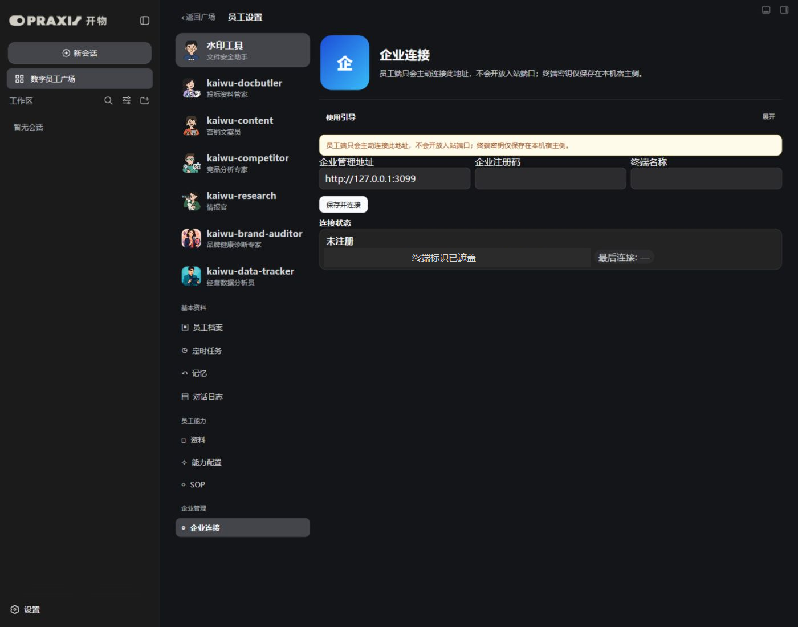

## 4. 跨设备接入与在线状态

中枢健康接口可通过 Tailscale 地址访问，返回 `ok: true` 和企业端版本信息。员工端B使用一次性注册码完成初次接入，此后没有再次填写注册码或修改 `terminal.json`。

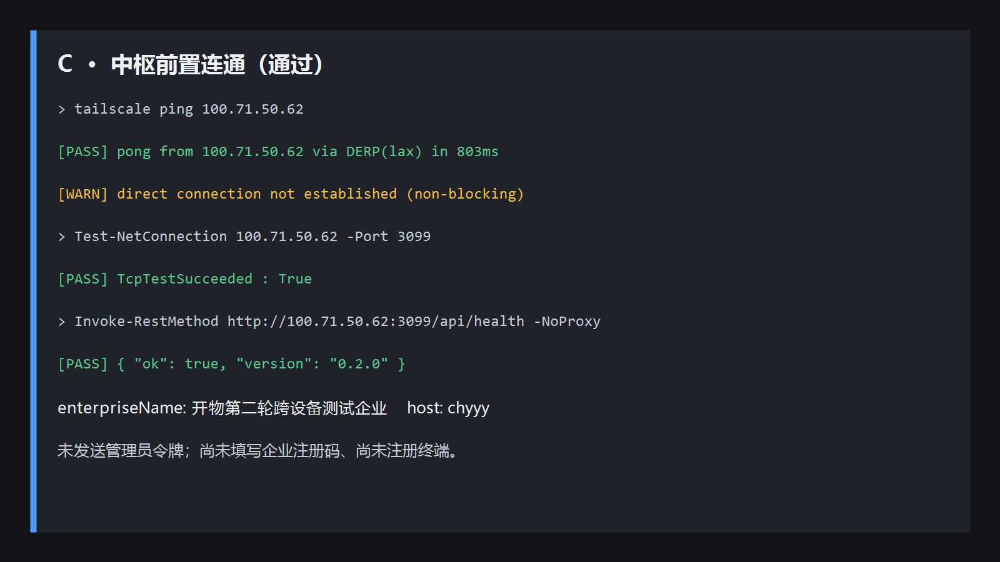

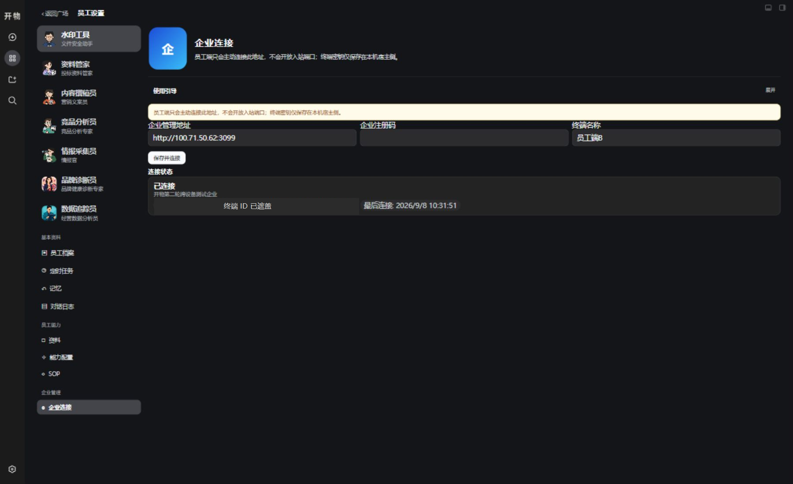

企业端能够同时识别两个独立终端，均为员工端 `0.5.0`，每端各包含 7 名数字员工，心跳持续更新。

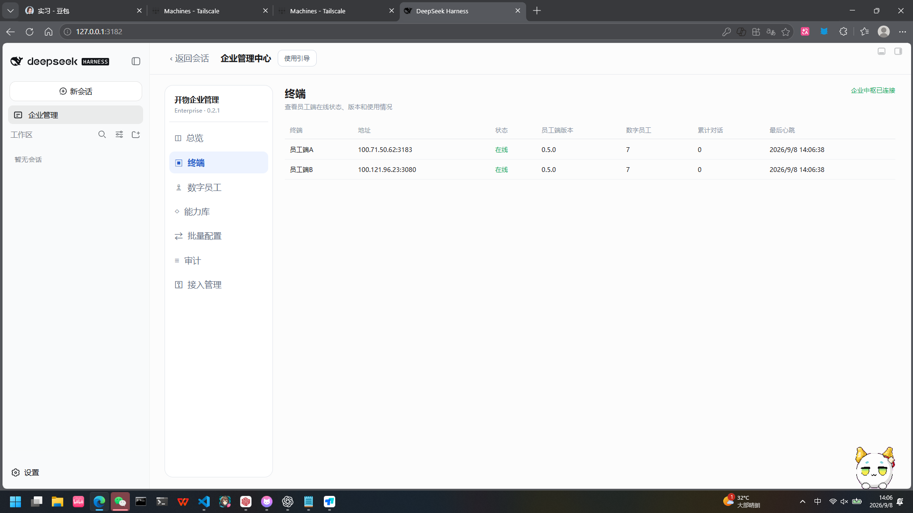

## 5. 在线批量配置测试

### 5.1 操作

企业端同时选择员工端A、员工端B，仅选择“数据追踪员”，下发资料：

```text
第二轮跨设备实机验收资料
```

### 5.2 结果

- 企业端生成两条终端指令，均成功回执。
- 员工端A与员工端B均生成对应 Markdown 文件。
- 员工端B文件使用 UTF-8 读取正常，无乱码。
- 员工端B文件 SHA-256：`32924D616890CD0E6242499CD7CDD238D0D8BD8FDCA45A8B35C83C7A317BA212`。

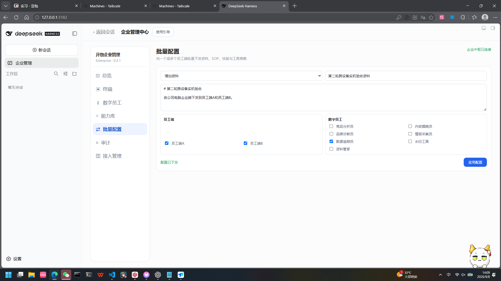

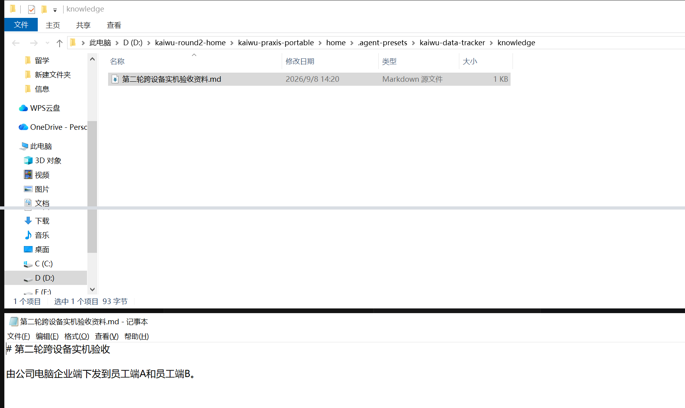

## 6. 离线队列与恢复执行测试

### 6.1 离线状态

停止员工端B的 DSH 进程后，3080停止监听，但 Tailscale保持在线。企业端在心跳超时后将员工端B标记为“离线”，员工端A不受影响。


### 6.2 离线下发

员工端B离线期间，仅向员工端B的“数据追踪员”下发：

```text
第二轮离线队列验收资料
```

指令最初状态为 `queued`，`attempts = 0`，审计结果显示“待执行”。


### 6.3 恢复执行

员工端B重新启动后：

- 企业连接自动恢复，无需重新输入注册码。
- 离线指令自动领取并成功执行。
- 数据库最终状态为 `succeeded`，`attempts = 1`。
- 审计结果由“待执行”更新为“成功”。
- 文件为 UTF-8、无 BOM、无乱码，内容与下发内容完全一致。
- 员工端B文件 SHA-256：`EB590EEA6EAA348602F7256BFC3CB8E8FA502F7397FC50753F49907AE576E8E9`。

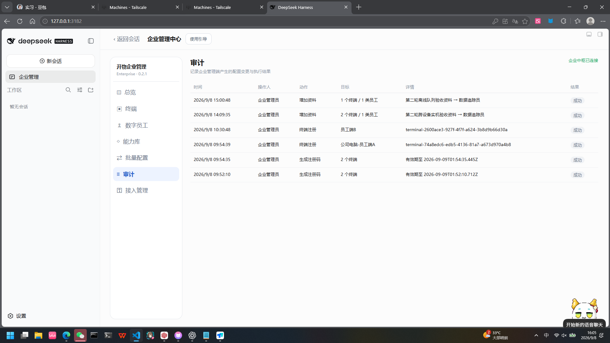

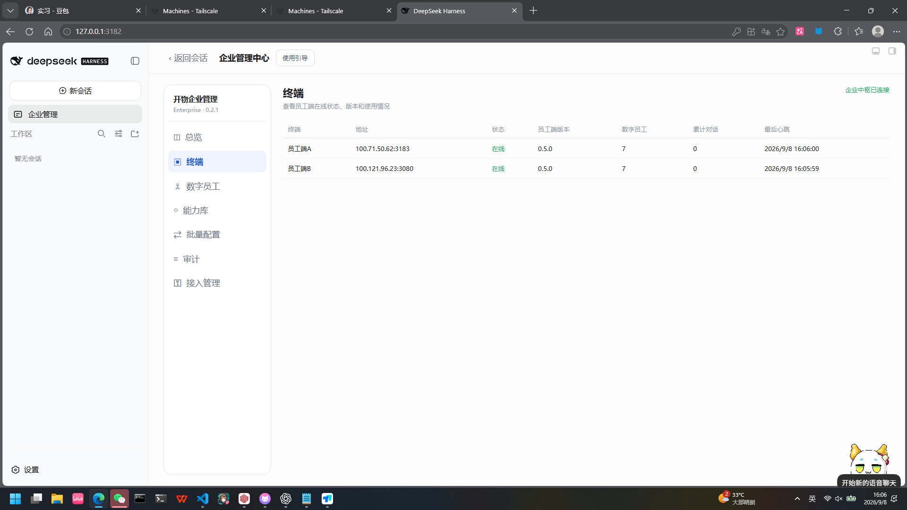

该用例证明离线配置不会丢失，恢复后只执行一次，并能形成成功回执。

## 7. 企业中枢重启持久化测试

### 7.1 停机隔离

停止企业中枢后：

- 3182 与 3099 均停止监听。
- 员工端A继续运行。
- 员工端B仍能通过 Tailscale ping 到企业中枢所在节点。
- `Test-NetConnection 100.71.50.62 -Port 3099` 返回 `TcpTestSucceeded : False`。

这说明失败点确实是中枢服务停止，而不是设备掉线或虚拟内网断开。

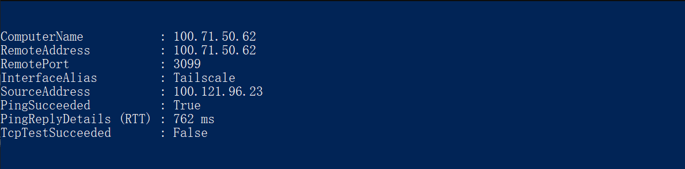

### 7.2 原数据库重启

企业中枢使用原 SQLite 数据目录重新启动，并更换新的临时管理员令牌。重启后：

- 健康接口返回 `ok: true`、版本 `0.2.1` 和原企业名称。
- 员工端A/B均自动恢复在线，无需重新注册。
- 原有终端、员工实例、能力资产、指令和审计数据全部保留。
- 总览仍显示2个在线终端、14个员工实例、58项能力资产。

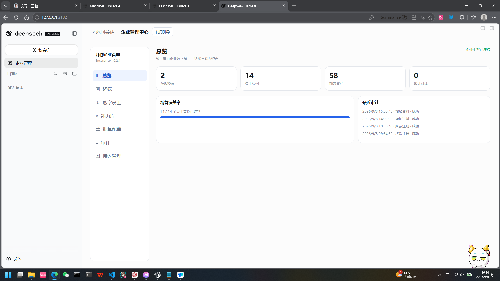

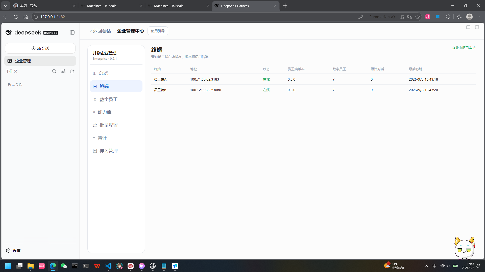

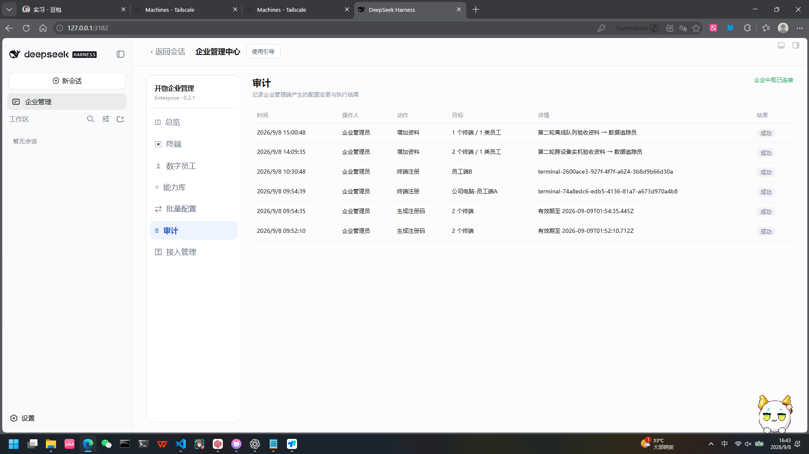

## 8. 测试数据清理

企业端分别向员工端A/B下发删除指令，删除：

- `第二轮跨设备实机验收资料.md`
- `第二轮离线队列验收资料.md`

验收结果：

- 员工端A：两份文件均不存在。
- 员工端B：两份文件均不存在，目标目录为空。
- 两端均保持在线，企业连接正常。
- 四条删除指令全部 `succeeded`，每条 `attempts = 1`。
- 审计记录保留，用于后续复查。

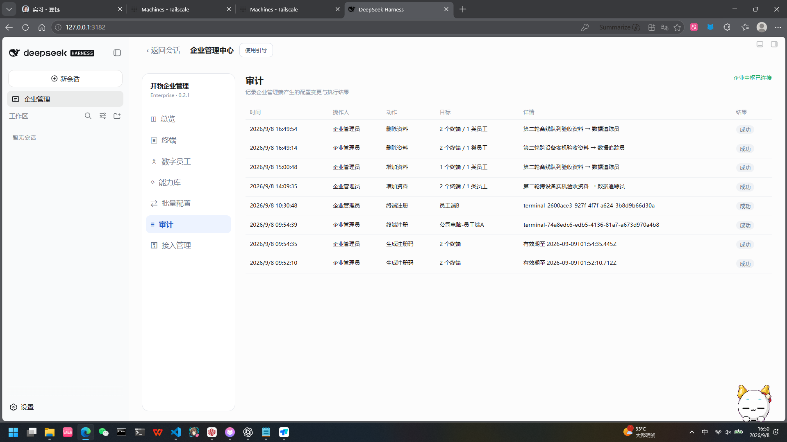

## 9. 数据库终态核验

对 `enterprise.db` 进行只读核验，结果如下：

| 项目 | 结果 |
|---|---:|
| 纳管终端 | 2 |
| 在线终端 | 2 |
| 配置指令总数 | 7 |
| `succeeded` 指令 | 7 |
| 其他状态指令 | 0 |
| 重复执行 | 0 |

7条指令的构成为：在线资料下发2条、离线资料补执行1条、资料清理4条。所有指令执行次数均为1。

## 10. 测试中发现并处理的问题

### 10.1 中枢端口最初不可达

现象：Tailscale节点在线，但员工端B无法访问3099。

处理：重新启动企业中枢并确认同时监听公司设备的 Tailscale 地址和 `127.0.0.1`。健康接口恢复后完成远端复测。

### 10.2 网络切换导致 Tailscale 协调连接异常

现象：设备显示已登录，但状态离线，无法连接协调服务器。

处理：恢复可用网络并重新建立 Tailscale 会话。最终两端均在线；无法建立点对点直连时经 DERP 中继，不影响本轮功能验收。

### 10.3 退出远程控制后员工端B短暂离线

原因：Windows Tailscale 无人值守模式未启用。

处理：启用无人值守模式，确认 `ForceDaemon: true`、服务为 `Running`。退出远程控制后连续观察2分钟，心跳持续更新，随后完成离线队列和中枢重启测试。

## 11. 安全与边界核验

- 企业中枢管理员令牌仅保存在本机浏览器和运行进程中，测试截图与报告均未记录明文。
- 企业注册码使用后未再次填写或传播。
- 未读取、删除或手工修改员工端 `terminal.json`。
- 未将3099暴露到公网，也未使用端口转发或 Tailscale Funnel。
- 未关闭 Windows 防火墙；本轮未发现需要清理的专用3099防火墙规则。
- 中文 UI、接口数据和落盘 Markdown 均未发现乱码。

## 12. 最终判定

第二轮跨设备基础版满足操作手册中的全部通过标准：

- 两台物理设备通过虚拟内网互联。
- 企业端与员工端插件独立部署，员工端包含规定的三个配套插件。
- 企业端可同时纳管两个独立员工端。
- 在线批量配置能够跨设备落盘。
- 离线配置能够排队，恢复在线后只执行一次并成功回执。
- 企业中枢重启后终端、指令和审计数据不丢失。
- 员工端无需重新注册即可恢复连接。
- 测试数据已清理，审计证据完整保留。

**最终结论：通过，可进入下一阶段。**
