# 开物 Praxis 第三轮公司内网多终端实机测试验收报告

## 1. 验收结论

**本轮公司内网跨设备功能验收通过；后续补充的员工端 `v0.5.1` 重新打包与本机空白实例回归也已通过。**

2026-09-09，企业中枢与一台同事 Windows 电脑上的独立员工端 C 在公司内网中完成实机联调。已验证交付包一致性、员工端独立安装、公司内网接入、在线资料下发、离线指令排队、恢复后自动执行、企业中枢重启后的自动重连与数据持久化，以及测试资料清理。

测试中发现“资料名称已经带 `.md` 时再次追加扩展名”的缺陷。现场通过规范化名称重新下发后复测通过；员工端和企业端源码均已增加防重复扩展名处理，相关自动化回归分别为 6/6 与 20/20 通过。

同事实机测试使用的 `v0.5.0` EXE 是修复前构建，因此本报告保留其现场验证边界。2026-09-09 已另行生成员工端 `v0.5.1` ZIP/EXE，并从最终 ZIP 解压空白实例补做“输入名称带 `.md`”的在线、离线和删除回归，全部通过。详见同目录的《v0.5.1重新打包与本机回归报告》。

## 2. 测试环境

| 项目 | 配置 |
|---|---|
| 测试日期 | 2026-09-09（Asia/Shanghai） |
| 网络 | 公司内网以太网；本轮业务链路未使用 Tailscale |
| 企业中枢 | `192.168.11.55:3099`，企业端插件 `0.2.1` |
| 企业管理页面 | 企业中枢本机 `127.0.0.1:3182` |
| 员工端 C | `192.168.11.15:3080`，员工端插件 `0.5.0` |
| 员工端操作系统 | Windows 10 家庭中文版 25H2（构建 26200） |
| 数字员工 | 7 名；本轮配置目标为“数据追踪员” |
| 员工端安装方式 | `kaiwu-praxis-setup-v0.5.0.exe` |

员工端 C 使用的 EXE SHA-256：

```text
D2B740C4D1895C32C286049557D73520C876AA8F9074815D6E53DD9F006BB664
```

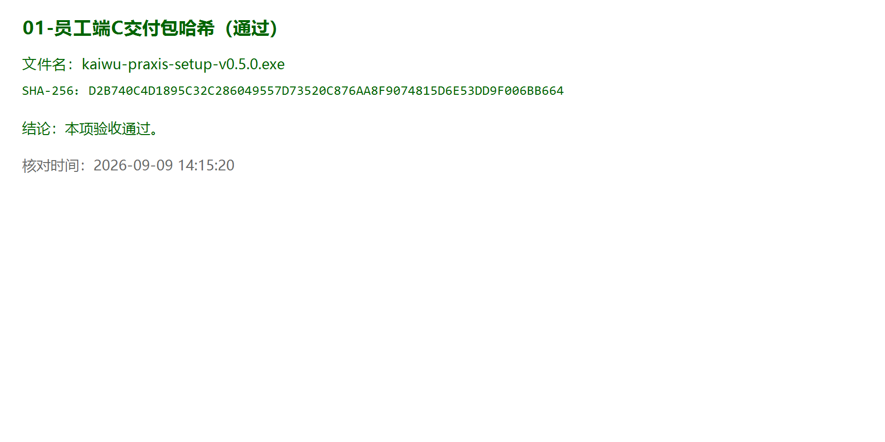

## 3. 插件安装与员工端启动

员工端 C 的独立环境包含：

| 插件 | 版本 | 结果 |
|---|---:|---|
| `kaiwu-praxis` | `0.5.0` | 通过 |
| `@nanmicoder/dsh-agent-teams` | `0.1.14` | 通过 |
| `@vectorize-io/hindsight-coding-agents` | `0.4.3` | 通过 |
| `dsh-better-sidebar` | `0.17.1` | 通过 |
| `kaiwu-praxis-enterprise` | 未安装 | 符合员工端/企业端独立交付要求 |

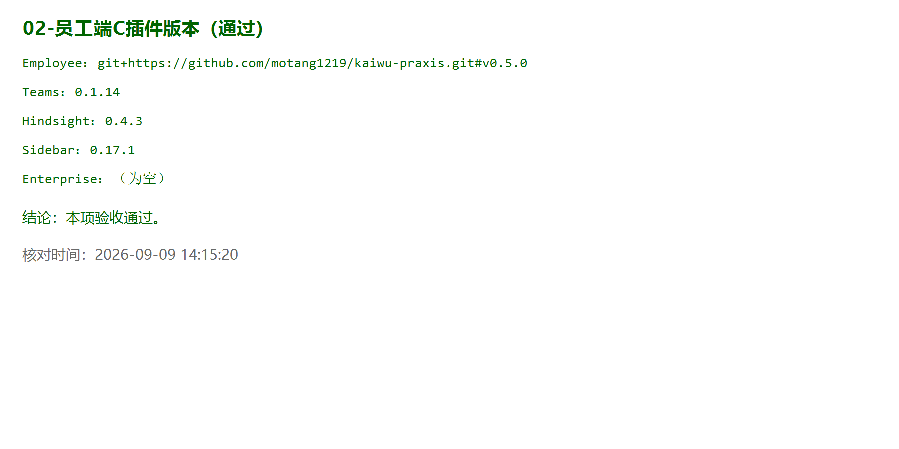

员工端启动后，3080 端口处于监听状态，本机 HTTP 请求返回 200，7 名数字员工均可见。


## 4. 公司内网接入与注册

员工端 C 到企业中枢 `192.168.11.55:3099` 的 TCP 检查通过，健康接口返回 `ok: true` 和企业端版本 `0.2.1`。这证明本轮连接走公司真实内网地址，不依赖同机回环地址或虚拟组网地址。

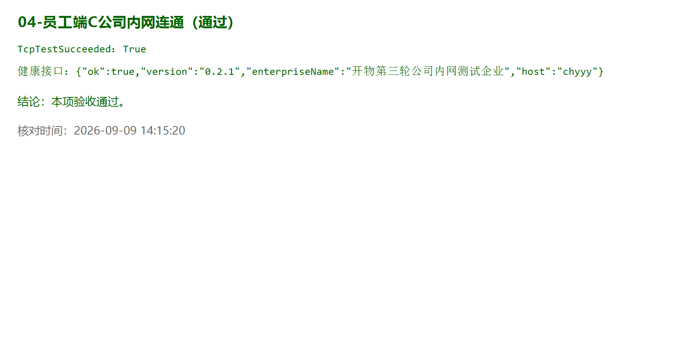

员工端使用一次性企业注册码完成首次注册。注册成功后，注册码输入框为空，连接状态为“已连接”，终端名称为“员工端 C”。报告和截图均未记录注册码、管理员令牌或终端密钥。


## 5. 在线资料下发与缺陷复测

### 5.1 首次下发

企业端向员工端 C 的“数据追踪员”下发在线资料。内容按 UTF-8 正确落盘，SHA-256 为：

```text
8DC97F9582417E706B470507A032FCFCFA5E3C7C77C321E6DE603B0ABC8C2E41
```

但首次提交的资料名称已包含 `.md`，员工端又追加一次扩展名，实际生成 `第三轮公司内网实机验收资料.md.md`。因此首次用例判定为不通过，未将“内容正确”误判为整体通过。

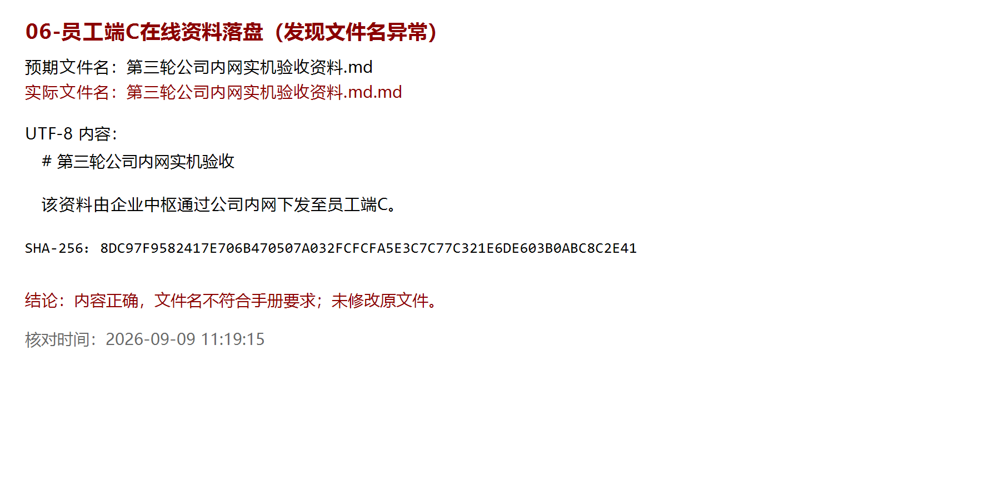

### 5.2 现场恢复与复测

企业端删除错误文件，并使用规范化名称重新下发。复测结果：

- 错误的 `.md.md` 文件不存在；
- 正确的 `.md` 文件存在；
- UTF-8 中文内容完全一致，无乱码；
- SHA-256 与首次正确内容一致。

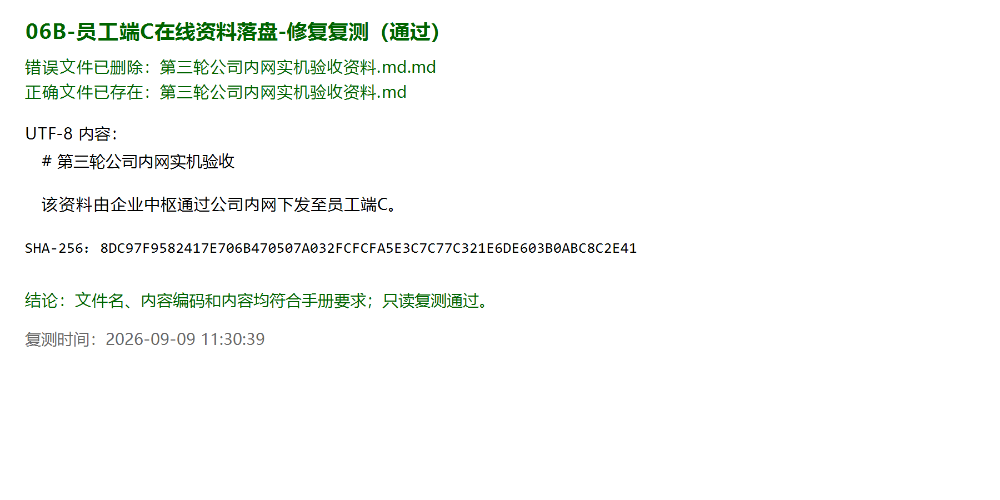

### 5.3 源码修复与自动化回归

已在两端源码增加双层保护：

- 员工端：资料或 SOP 名称已带目标扩展名时不再重复追加；
- 企业端：对增加/删除资料及 SOP 的批量配置名称进行规范化，并拒绝规范化后的空名称。

本次复跑结果：

| 自动化测试 | 结果 |
|---|---:|
| 员工端文件名回归 `scripts/test-document-filenames.mjs` | 6/6 通过 |
| 企业中枢回归 `scripts/test-hub.mjs` | 20/20 通过 |

边界说明：现场复测证明旧客户端在企业端使用规范化名称后业务可恢复；上述自动化测试证明当前源码能够防止该缺陷。客户端源码修复是否进入正式 EXE，仍须以重新打包后的空白实例实测为准。

## 6. 离线队列与恢复执行

### 6.1 员工端离线

11:38:25 停止员工端 C 后，3080 不再监听；公司网络与解压目录未改变。企业中枢在心跳超时后将终端标记为离线。

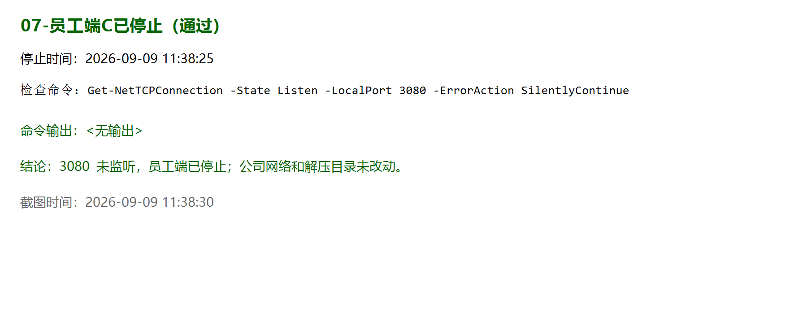

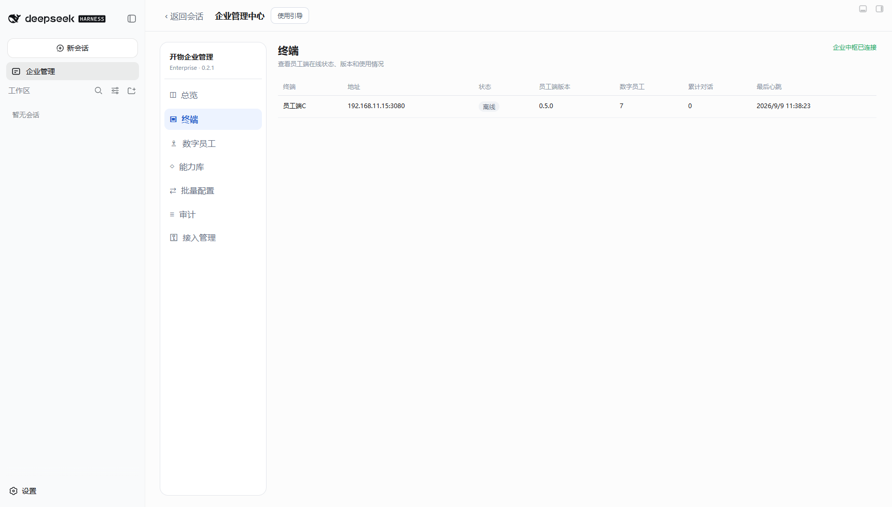

### 6.2 离线下发与自动补执行

员工端离线期间，企业端向“数据追踪员”下发 `第三轮离线队列验收资料`。企业中枢记录该指令为待执行，尚未产生送达和完成回执。

11:46:43 恢复员工端后：

- 3080 恢复监听并返回 HTTP 200；
- 企业连接在未重新填写注册码、未修改本地终端配置的情况下自动恢复；
- 离线资料自动落盘且只执行一次；
- UTF-8 内容正确；
- 文件 SHA-256 为 `28EB6EB5E03C985F04CAC36D554505F23C1D96A5288E119C21B47C566B5FB554`；
- 企业端指令最终状态为成功，执行次数为 1。

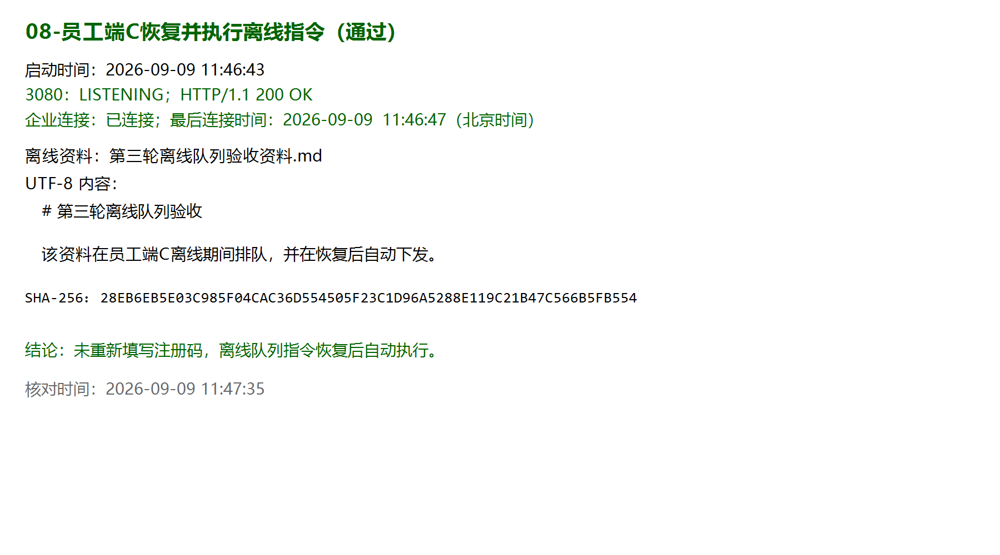


## 7. 企业中枢重启与持久化

企业中枢使用原数据目录重启。员工端 C 本身未重启，也未重新填写注册码或修改终端配置。重启后：

- 企业中枢健康接口恢复；
- 员工端 C 使用原身份自动重连，最后心跳继续更新；
- 原终端注册、指令和审计数据保留；
- 在线资料和离线资料均仍存在；
- 重启前后终端身份一致，具体标识未写入报告。

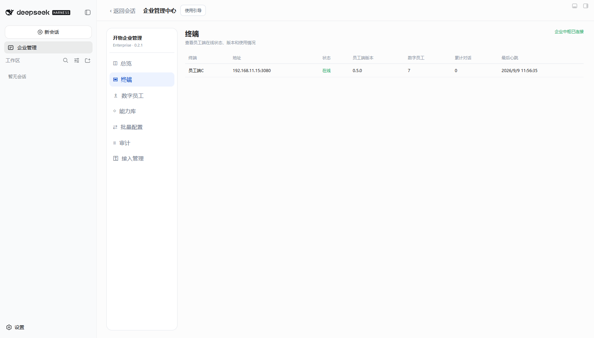

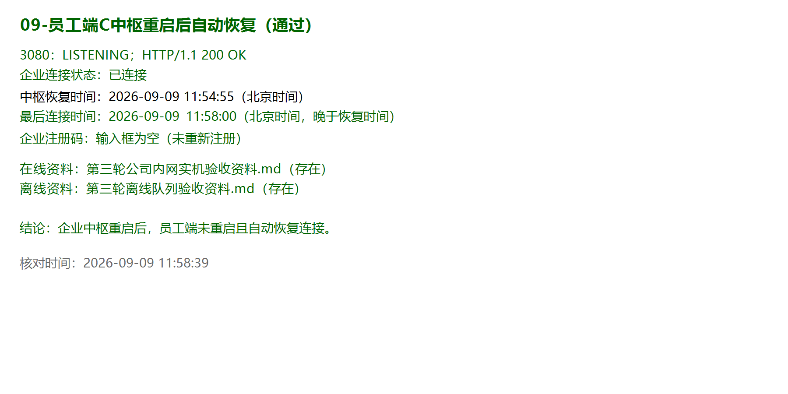

测试过程中因临时管理员令牌随进程生命周期失效，额外短暂重启过一次中枢以生成新的临时令牌。员工端仍自动恢复连接，不影响持久化结论；正式产品后续应提供更明确的令牌持久化或轮换流程。

## 8. 测试数据清理

企业端通过正式配置接口删除在线资料、离线队列资料及首次生成的错误文件。最终只读检查结果：

- 三个目标路径均不存在；
- “数据追踪员”知识目录为空；
- 员工端 3080 仍为 HTTP 200；
- 企业连接仍为“已连接”；
- 删除指令均成功且各执行一次；
- 审计记录保留。

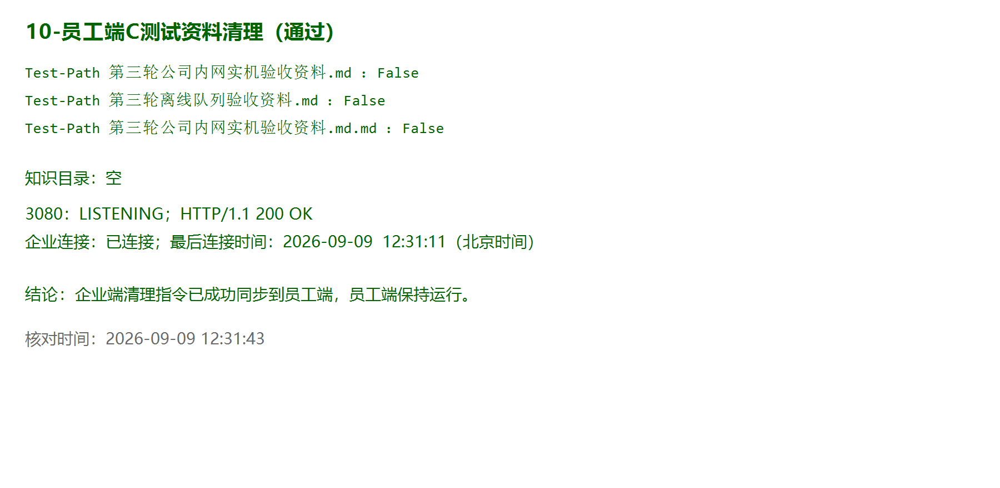

## 9. 验收项汇总

| 序号 | 验收项 | 结论 |
|---:|---|---|
| 1 | EXE 文件与 SHA-256 校验 | 通过 |
| 2 | 员工端及三个捆绑插件独立安装 | 通过 |
| 3 | 企业端插件未混装到员工端 | 通过 |
| 4 | 员工端 3080 启动与 7 名数字员工加载 | 通过 |
| 5 | 公司内网 TCP 与健康接口访问 | 通过 |
| 6 | 一次注册、后续自动恢复连接 | 通过 |
| 7 | 在线资料下发 | 首次发现缺陷；恢复复测通过 |
| 8 | 离线识别与指令排队 | 通过 |
| 9 | 员工端恢复后离线指令自动执行一次 | 通过 |
| 10 | 企业中枢重启后的身份、数据和连接恢复 | 通过 |
| 11 | 企业端删除资料并同步到员工端 | 通过 |
| 12 | 文件名缺陷源码回归 | 26/26 通过 |

## 10. 证据包完整性

同事提交的原始结果文件经校验：

| 文件 | SHA-256 |
|---|---|
| `员工端C测试结果.md` | `F6E836944D8030619DD8864A0222CB1D5A6B398EE44E2E01467FADF6C55A1496` |
| `员工端C-第三轮公司内网测试结果.zip` | `64139B118F4A8136CC976C16C7638163329BCB9CE705ADDF7DDF9C695258291E` |

压缩包完整性检查通过，共 12 个文件：11 张截图和 1 份测试结果 Markdown。压缩包内外两份 `员工端C测试结果.md` 的 SHA-256 完全一致。解压后的证据保存在本报告同目录的 `员工端C证据` 文件夹中。

## 11. v0.5.1 补充验证状态

1. 已重新构建包含双层文件名修复的员工端 `v0.5.1` ZIP、EXE 和内部 7z。
2. 已从最终 ZIP 解压空白实例，确认员工端与三个捆绑插件版本正确，且未混装企业端插件。
3. 已使用自带 `.md` 的名称完成在线增加、离线增加和删除复测，始终只生成单个 `.md`。
4. 后续对外分发前仍需将对应源码、版本标签和发布物同步到 GitHub，并更新面向外部测试者的操作手册。

## 12. 最终判定

本轮已证明：在公司真实内网中，中央部署的企业中枢可以纳管同事电脑上的独立员工端，远程配置支持在线执行、离线排队、恢复补执行、重启持久化和审计留痕。**第三轮公司内网多终端功能验收通过。**

当前源码已修复测试中发现的重复扩展名问题，包含修复的员工端 `v0.5.1` 交付候选包也已完成本机空白实例验收。正式对外发布前只需完成 GitHub 源码、标签、发布物和操作手册同步。
